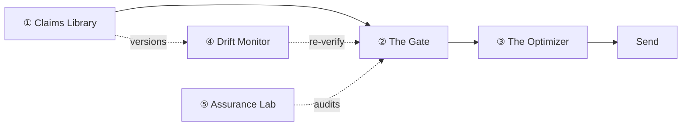

# Provenance — Architecture & Data-Process Diagrams

Two diagrams per module: an **architecture** view (components and how they connect) and a **data-process** view (the flow of data from system input to output). All 5 pillars are covered, plus a system overview.

## View them

- **Styled, presentation-ready:** open [`provenance-architecture.html`](./provenance-architecture.html) in a browser — all 12 diagrams rendered in the McKinsey palette, with action titles and captions. *(Renders Mermaid via CDN; needs a network connection.)*
- **Editable source:** the `diagrams/*.md` files below — Mermaid in markdown, renders inline on GitHub, editable in any PR.

## The diagrams

| File | Module | Architecture | Data process |
|------|--------|--------------|--------------|
| [`00-system-overview.md`](./diagrams/00-system-overview.md) | **System overview** | claim system of record | claim lifecycle loop |
| [`01-claims-library.md`](./diagrams/01-claims-library.md) | **① Claims Library** | extract → bind → approve → graph | source doc → queryable claim |
| [`02-the-gate.md`](./diagrams/02-the-gate.md) | **② The Gate** | calibrated-ensemble verification | draft → governed message + ledger |
| [`03-the-optimizer.md`](./diagrams/03-the-optimizer.md) | **③ The Optimizer** | bandit over verified arms only | toward per-segment convergence |
| [`04-drift-monitor.md`](./diagrams/04-drift-monitor.md) | **④ Drift Monitor** | dependency graph + re-verification | flow on a source change |
| [`05-assurance-lab.md`](./diagrams/05-assurance-lab.md) | **⑤ Assurance Lab** | adversarial self-test harness | claims → audited metric |

## How the modules connect

## Editing conventions

- Keep labels free of unquoted parentheses; use `·` / `,` / `+` separators and ` ` for line breaks.
- When you change a `diagrams/*.md` flow, update the matching string in `provenance-architecture.html` (the IDs map 1:1, e.g. `m2-arch`, `m2-flow`).
- Diagrams are the contract between owners — change them in the same PR that changes the code they describe.

**Source of record for the designs:** [`PROVENANCE-CAPSTONE.md`](../decks/PROVENANCE-CAPSTONE.md) · [`COHORT-DEMO-PROJECT-PLAN.md`](../decks/COHORT-DEMO-PROJECT-PLAN.md) · [`WHY-TECHNICALLY-CHALLENGING.html`](../decks/WHY-TECHNICALLY-CHALLENGING.html).
