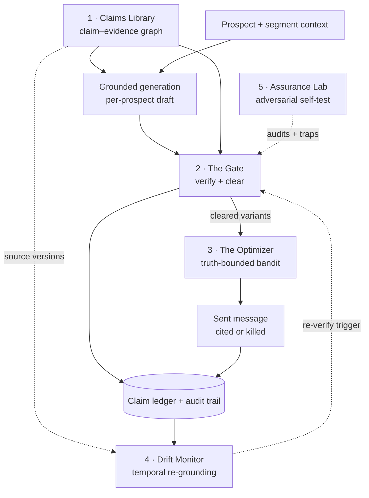
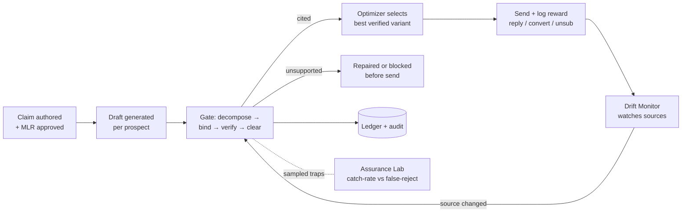

# Provenance — System Overview

> The product is a **system of record for claims**. Every claim has a tracked life, and an AI model is the primitive at each stage. Delete the models and there is no product — only a logger.

**The 5 modules** and the trust loop they form:

| # | Module | Role | Pillar |
|---|--------|------|--------|
| 1 | **Claims Library** | Claim–evidence graph; the approved, in-date source of truth | input / substrate |
| 2 | **The Gate** | Decompose → bind → verify → clear every claim before send | verification (core) |
| 3 | **The Optimizer** | Contextual bandit over **verified** variants only | decisioning |
| 4 | **Drift Monitor** | Re-verify when a source changes; pause/unblock live sends | temporal |
| 5 | **Assurance Lab** | Adversarially test the Gate; report decomposed reliability | proof / eval |

---

## Architecture — the claim system of record

**Read it as:** the Library feeds both generation and the Gate. The Gate clears only entailed, permissible claims; cleared variants are the *only* arms the Optimizer may pull. Every verdict lands in the ledger. The Drift Monitor watches source versions and re-triggers the Gate when truth changes. The Assurance Lab continuously attacks the Gate so its reliability is a measured number, not a promise.

---

## Data process — the claim lifecycle (system → output)

**The closed loop:** generate → verify → optimize → send → monitor → re-verify. The Optimizer pushes conversion *up*, but only inside the truth boundary the Gate draws — falsehoods never enter the reward loop, so the policy **cannot** converge to a higher-reward lie. That single property — *constrained optimization as a structural fix for reward-hacking* — is the project's most original bet.

---

**Source of record:** [`PROVENANCE-CAPSTONE.md`](../../decks/PROVENANCE-CAPSTONE.md) · [`COHORT-DEMO-PROJECT-PLAN.md §3`](../../decks/COHORT-DEMO-PROJECT-PLAN.md) · [`SOLUTION-DEEP-DIVE.html`](../../decks/SOLUTION-DEEP-DIVE.html)
