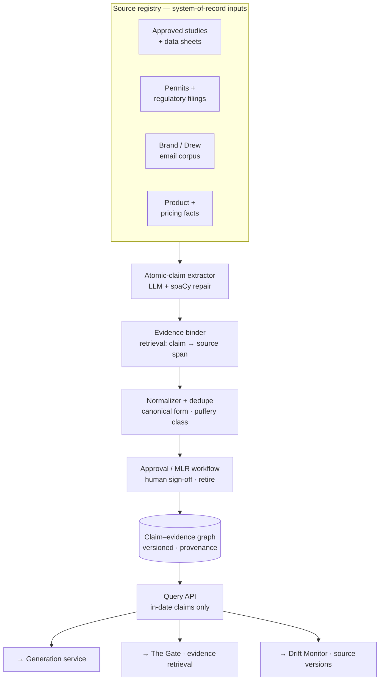
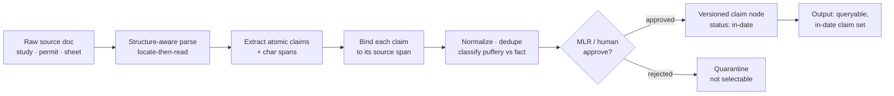

# Module 1 — Claims Library

> **Role:** the system-of-record substrate — a versioned **claim–evidence graph** that generation and the Gate draw from. Each claim node is bound to a source span, carries provenance, and has a status (in-date / retired).
>
> **Pillar:** input / substrate · **Owner:** Owner C (Platform / data) · **Maturity:** emerging

## What it does

Turns messy approved documents (studies, data sheets, permits, the Drew email corpus) into **atomic, checkable claims**, each bound to the exact source span it came from, normalized and de-duplicated, then gated through an MLR-style human approval. Generation and reps may pull **only** from the approved, in-date set — a retired claim is *not selectable*. This replaces flat RAG chunks with a structured, queryable claim/evidence substrate.

---

## Architecture — structure

| Component | Tech | MVP target |
|-----------|------|-----------|
| Atomic-claim extractor | GPT-4.1-mini / local Qwen + spaCy repair | ≥95% claim recall on eval set |
| Evidence binder | Hybrid BM25 + embeddings | top-3 contains gold source ≥90% |
| Claim–evidence graph | SQLite / Postgres, versioned nodes | every claim → source span + version |
| Approval workflow | Status field + audit | retired claim non-selectable |

---

## Data process — flow from source to queryable claim

**Input → output:** an unstructured approved document becomes a set of versioned, source-bound, approved claim nodes. Output consumers: the **Generation** service (drafts pull only approved claims), **The Gate** (retrieves evidence against these spans), and the **Drift Monitor** (tracks which source version each claim depends on).

---

## Interfaces

| Direction | Interface | Payload |
|-----------|-----------|---------|
| in | Source ingest | document + metadata + jurisdiction |
| out | `GET /claims?status=in_date&segment=…` | `[{claim_id, text, source_id, span, version}]` |
| out | Evidence lookup (Gate) | `claim_text → [{source_id, passage, score}]` |
| out | Version feed (Drift) | `claim_id → source_version` |

**Why it's hard:** decomposing fluent prose into atomic, checkable claims (compound claims, implicature, puffery vs. fact) and binding each to the exact span is unsolved at fidelity — and flat RAG chunking destroys the structure you need. A missed or mis-split claim is an *unverified* claim downstream. *(See [`WHY-TECHNICALLY-CHALLENGING.html`](../../decks/WHY-TECHNICALLY-CHALLENGING.html) · Capability 1.)*
