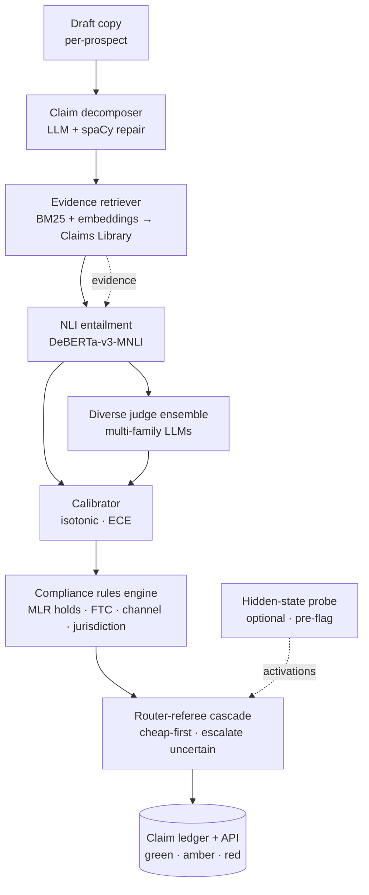

# Module 2 — The Gate

> **Role:** the core. Every draft is decomposed into atomic claims, each bound to evidence, checked for entailment by a calibrated ensemble, run through compliance rules, and routed through a cheap-first cascade. Output: a **claim ledger** — green (cited), amber (repaired / disclaimer), red (blocked). *Cited or killed.*
>
> **Pillar:** verification (core) · **Owner:** Owner A (Verification) · **Maturity:** frontier

## What it does

Answers, for every claim in a generated message, "**is this entailed by its source, and is it permissible?**" with calibrated confidence and **no ground truth at inference**. It replaces the unreliable single LLM-judge (>50% bias-test failure, gameable) with NLI + a calibrated diverse-judge ensemble doing **selective prediction**, plus a compliance-rule engine for legal/MLR holds. A router-and-referee cascade runs cheap checks first and escalates only the uncertain.

---

## Architecture — structure



| Stage | Model / tech | MVP target |
|-------|--------------|-----------|
| Decomposition | GPT-4.1-mini / local Qwen | ≥95% claim recall |
| Retrieval | Hybrid BM25 + embeddings | top-3 holds gold source ≥90% |
| NLI | DeBERTa-v3-large-MNLI | calibrated P_entailed |
| Ensemble + calibration | Diverse-family judges + isotonic | reported ECE |
| Rules | YAML/JSON DSL + regex | 100% on planted MLR holds |
| Ledger | Postgres + API | <200 ms p95 |

---

## Data process — flow per generated asset

```mermaid
sequenceDiagram
  participant Draft
  participant Dec as Decomposer
  participant Ret as Retriever
  participant NLI as NLI + Ensemble
  participant Cal as Calibrator
  participant Rules as Compliance Rules
  participant Cas as Router-Referee
  participant Led as Claim Ledger

  Draft->>Dec: raw copy
  Dec->>Ret: atomic claims + spans
  Ret->>NLI: claim + retrieved evidence
  NLI->>Cal: entailment + ensemble scores
  Cal->>Rules: calibrated entailment confidence
  Rules->>Cas: permit · block · needs-disclaimer
  Cas->>Cas: cheap checks first; escalate uncertain
  Cas->>Led: verdict per claim
  Led-->>Draft: green cite · amber repair · red block
```

**Input → output:** a raw draft enters; a **governed message + ledger** exits. Green claims carry their citation; amber claims are repaired or disclaimed; red claims are blocked before send. Legal sets the rules **once**; every message is then auto-checked in seconds.

**Demo-tenant rules (Gauntlet):** block guaranteed income / job placement · block health claims tied to personal attributes · block "#1 in cohort" without source · block competitor disparagement without substantiation · require disclaimer on educational-outcome claims.

---

**Why it's hard:** this is the single hottest problem in applied AI — *"verification is the bottleneck"* (Karpathy). The verifier is load-bearing: a false-negative ships a lie, a false-positive kills good copy, and calibration can decay off-domain. Mitigation: NLI + diverse ensemble + calibration, **proven in the Assurance Lab**, never a bare yes/no. *(See [`WHY-TECHNICALLY-CHALLENGING.html`](../../decks/WHY-TECHNICALLY-CHALLENGING.html) · Capability 2.)*
