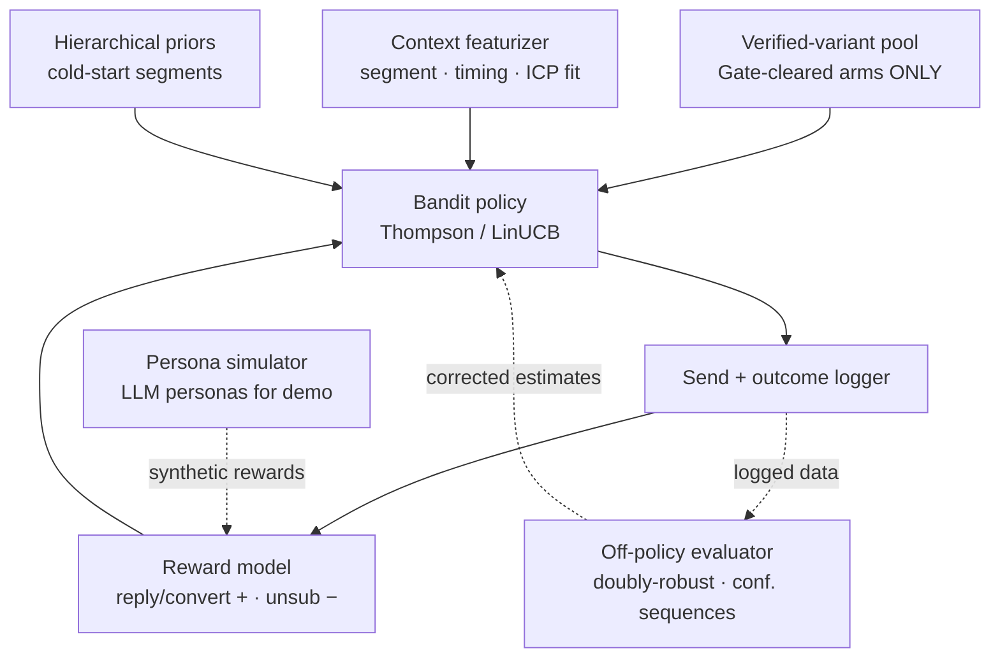
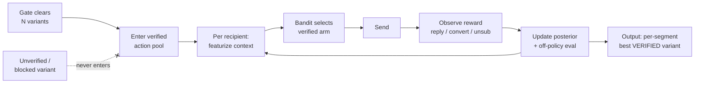

# Module 3 — The Optimizer

> **Role:** a contextual bandit that learns the best message **per micro-segment** — but over a **constrained action space** of *verified + cleared variants only*. Pruning the action space to verified outputs is a **structural fix for reward-hacking**: the policy cannot converge to a higher-reward falsehood because falsehoods never enter the reward loop.
>
> **Pillar:** decisioning · **Owner:** Owner B (Decisioning) · **Maturity:** frontier · most novel

## What it does

Replaces a slow, one-thing-at-a-time manual A/B with a contextual bandit (Thompson / LinUCB) that adaptively routes each recipient to the best-performing message for their segment. Reward = reply / convert; unsubscribe = hard negative. Hierarchical priors handle cold-start segments; off-policy evaluation (doubly-robust) learns from tiny logged data. **The arms are only ever Gate-cleared variants** — the truth boundary is the guardrail on the RL loop.

---

## Architecture — structure

> **The guardrail:** a blocked / unverified variant **never enters `POOL`**, so the policy has no path to "win by lying." This is the anti-Goodhart boundary.

| Component | Tech | Notes |
|-----------|------|-------|
| Policy | Contextual bandit · Thompson / LinUCB | arms = verified variant IDs |
| Cold-start | Hierarchical priors | borrow strength across segments |
| Eval | Doubly-robust OPE + anytime-valid CIs | learn from logged sends |
| Demo | LLM-persona simulator | offline; not live cohort traffic |

---

## Data process — flow toward per-segment convergence

**Input → output:** verified variants in, a **per-micro-segment optimal message** out — "$/head ROI" wins for feedlots, "peer-hospital reference" for procurement — with continuous conversion lift and **zero added liability**, because only true variants ever compete.

---

**Why it's hard:** sequential decisions under sparse, delayed, expensive, irreversible feedback (replies are rare and slow; each send costs a lead), off-policy learning on tiny data, and per-segment cold-start — *and* the optimizer is intrinsically reward-hack-prone (maximizing engagement teaches it to exaggerate). Mitigation: persona simulator + hierarchical bandit + off-policy eval; and the **constrained-optimization-can't-lie** property holds regardless of sim-to-real gap. *(See [`WHY-TECHNICALLY-CHALLENGING.html`](../../decks/WHY-TECHNICALLY-CHALLENGING.html) · Capability 3.)*
