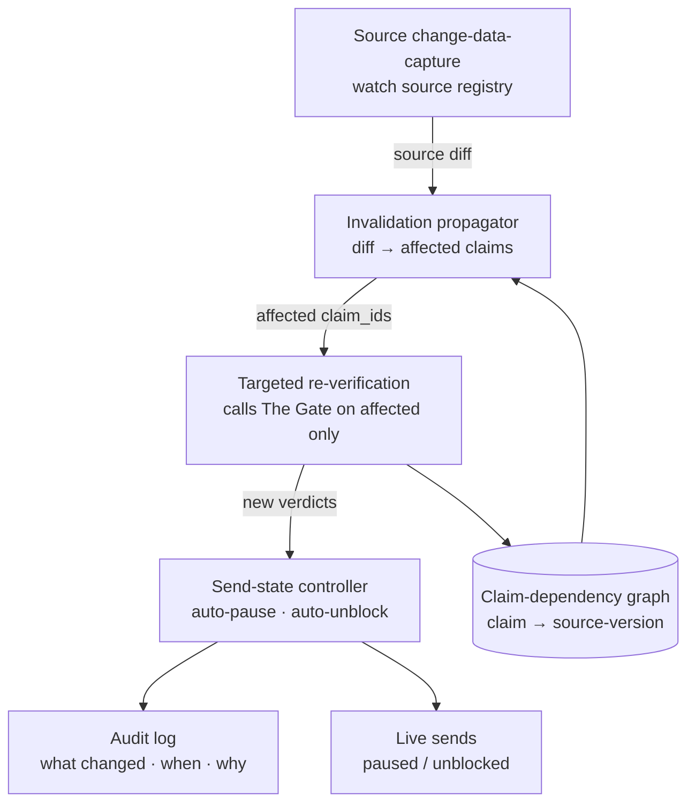
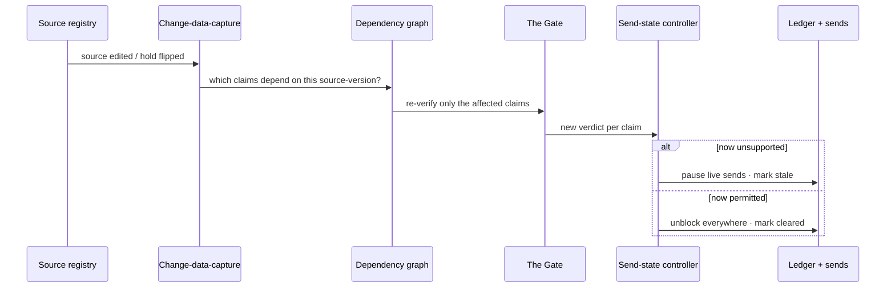

# Module 4 — Drift Monitor

> **Role:** treats truth as a **temporal** property. A verified claim is only true *until its source changes*. A claim-dependency graph + change-data-capture on sources propagates invalidation to exactly the affected claims, re-verifies only those, and auto-pauses or unblocks live sends.
>
> **Pillar:** temporal · **Owner:** Owner B (Decisioning) · **Maturity:** frontier

## What it does

Solves the "memory goes stale" problem for marketing claims. When a permit changes, a study is retracted, or a legal hold flips, the monitor detects the source diff, walks the dependency graph to find which of N live claims it invalidates, re-runs **only those** through the Gate, and updates send state: a now-false claim is **paused** before it sends; a now-allowed claim **unblocks everywhere instantly**. Incremental cache-invalidation, for truth.

---

## Architecture — structure

| Component | Tech | Target |
|-----------|------|--------|
| Change-data-capture | Source hashing / diff on registry | detect change ≤ poll interval |
| Dependency graph | claim → source_version edges | conservative completeness |
| Re-verification | Reuse the Gate on affected subset | re-Gate one profile <60 s on stage |
| Send-state controller | Pause/unblock + ledger write | no stale claim ships |

---

## Data process — flow on a source change

**Input → output:** a source change in, **always-current claim states** out. Capitalize newly-cleared claims immediately (revenue) and avoid stale-claim liability (risk) — with no manual re-audit of the corpus. *Demo beat:* facilitator changes one rule in the tenant YAML → re-Gate one profile → stale badge → updated ledger in under 60 s.

---

**Why it's hard:** detecting which of N live claims a source change invalidates — and re-verifying only those — is a state/dependency problem most "memory" work doesn't test (it tests retrieval, not whether state stays *correct* over time). Mitigation: conservative invalidation. It breaks toward over-invalidation (too many re-checks) or under-invalidation (staleness slips through) — dependency-graph completeness is the crux. *(See [`WHY-TECHNICALLY-CHALLENGING.html`](../../decks/WHY-TECHNICALLY-CHALLENGING.html) · Capability 4.)*
