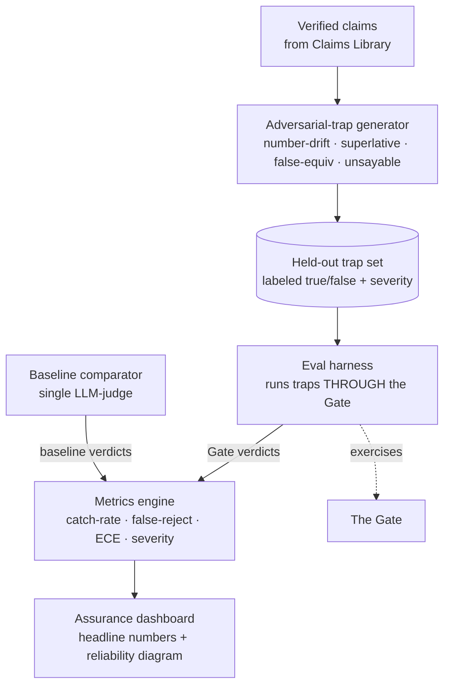
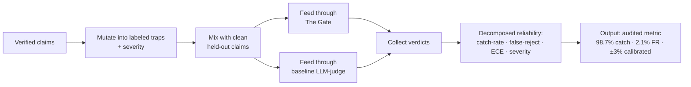

# Module 5 — Assurance Lab

> **Role:** proves the Gate works by **adversarially attacking it** and reporting **decomposed reliability** — catch-rate at fixed false-reject, paraphrase robustness, calibration (ECE / reliability diagrams), severity buckets — because a single pass-rate hides failures and can be gamed. A wind tunnel for the checker.
>
> **Pillar:** proof / eval · **Owner:** Owner A (Verification) · **Maturity:** frontier

## What it does

Generates synthetic adversarial traps by mutating verified claims (number-drift, unsupported superlative, false equivalence, true-but-unsayable), runs the whole held-out set **through the Gate**, and computes a decomposed reliability profile against a single-LLM-judge baseline. Turns "trust us, the AI checks the claims" into an audited number a risk committee can act on.

---

## Architecture — structure

| Component | Tech | Target (illustrative) |
|-----------|------|-----------------------|
| Trap generator | Mutation operators over verified claims | ≥20 traps for demo |
| Eval harness | Batch run through real Gate | reproducible |
| Metrics engine | catch-rate @ fixed FR · ECE · severity buckets | catch >90% ensemble vs ~70% judge-only |
| Calibration | Reliability diagram + ECE | ±3% |
| False reject | On clean held-out claims | <5% |

---

## Data process — flow from claims to audited metric

**Input → output:** verified claims in, an **audited assurance metric** out — a number you put in front of legal, the board, and procurement. It directly answers benchmark-gaming and "average success hides failures," and assurance itself becomes a revenue lever (it shortens enterprise sales cycles).

---

**Why it's hard:** proving a verifier works means adversarially testing your *own* checker and reporting reliability decomposed beyond a single pass-rate. Synthetic traps may not represent real failures (sim-to-real for the eval itself). Mitigation: diverse mutation operators + a real held-out slice. It breaks if a verifier passes traps but misses real lies. *(See [`WHY-TECHNICALLY-CHALLENGING.html`](../../decks/WHY-TECHNICALLY-CHALLENGING.html) · Capability 5.)*
