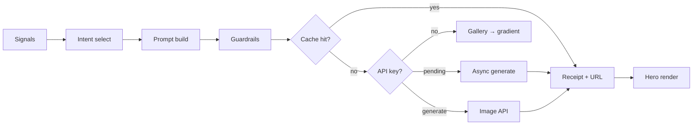

# Action-image personalization — repeatable framework

> Action-driven hero image personalization with full provenance. One tenant = one YAML
> config; GauntletAI is the reference implementation. DECISIONS R28.

This sits on the [personalization provenance spine](PERSONALIZATION-PROVENANCE.md): the same
`say` / `allude` / `hold` surface policy gates what may enter a prompt, and every image
decision lands in the `/dev` receipt.

---

## 1. Overview

**Purpose:** Select a visual strategy (intent) from visitor signals, build a structured
prompt that supports (not competes with) the page headline, generate or fall back to a cached
asset, and log a full receipt.

**Principles:**
- Deterministic selection — no LLM in intent routing
- Config-driven tenants — `rules/<tenant>_image.yaml`, not hardcoded Python
- Provenance-first — intent, layers, guardrails, cache key, model, vendor on every receipt
- Non-blocking page load — cache check only at render; async API on `/api/.../hero-image`

**Code map:**

| Piece | Location |
|---|---|
| Intent framework | `pipeline/personalization/image_intents.py` |
| Generation + cache | `pipeline/personalization/image_gen.py` |
| Gauntlet page builder | `pipeline/personalization/gauntlet_site.py` |
| Gauntlet tenant config | `rules/gauntlet_image.yaml` |
| Blank template | `rules/_image_template.yaml` |

---

## 2. Pipeline



**Signal inputs** (from `build_image_ctx(page)`):
- Entry channel, ad variant id, audience route
- Top 1–3 prioritized objections
- Industry / region (tier-gated)
- Hero CTA primary (for `drives_action` linkage)
- `_hold` fields — guardrail stripping only, never emitted

**Offline fallback chain:** disk cache → API (if keyed + `generate=True`) → curated gallery
(`scene.image_for`) → CSS gradient.

---

## 3. Intent taxonomy template

Define 5–8 intents per company in YAML. Each intent is a conversion hypothesis with a visual
metaphor — not a stock photo category.

| Field | Purpose |
|---|---|
| `id` | Stable slug (`peer_proof`, `message_match`, …) |
| `conversion_goal` | What click/apply this visual supports |
| `sales_technique` | Named technique (Cialdini, loss aversion, …) |
| `design_principles` | Composition rules for the image model |
| `composition_template` | Prompt slot — supports `{environment}`, `{ad_metaphor}`, `{objection_metaphor}`, `{accent_color}` |
| `visual_metaphor` | One-line abstract metaphor |
| `mood` | Tone anchor |
| `color_rules` | Brand accent usage |
| `allowed_signals` | Documentation — which signals may shape this intent |
| `blocked_signals` | Documentation — what must never appear |

Gauntlet ships seven intents: `peer_proof`, `loss_avoidance`, `authority`, `aspiration`,
`roi_clarity`, `retarget_warm`, `message_match`. See `rules/gauntlet_image.yaml`.

---

## 4. Signal → intent mapping rules

Rules live under `selection` in tenant YAML:

```yaml
selection:
  primary_rules:    # elif chain — first match wins
    - when:
        ad_variant_id: x-keyword
        top_objection: open_market_hire
      picks:
        - intent_id: message_match
          rank: 1
          why: "human-readable provenance string"
          signals_used: [ad_keyword, objection_open_market_hire]

  fallback_rules:   # additive when primary matched nothing
    - when:
        ad_variant_id: $present    # special: field is non-null
      picks: [...]
    - when: {}                     # default — only if still no picks
      picks: [...]
```

**`when` keys:** `ad_variant_id`, `top_objection`, `audience_route`, `channel`, or any
`build_image_ctx` field.

**Special values:**
- `$present` — field is non-null
- `$next` — next rank after existing picks
- `when_objection_loss: true|false` on a pick — branch loss_avoidance vs peer_proof

**Mapping sources to consider:**

| Signal source | Example `when` |
|---|---|
| Entry channel | `channel: ad` |
| Ad variant | `ad_variant_id: x-keyword` |
| Audience route | `audience_route: b2b_hire` |
| Top objection | `top_objection: ld_budget_committed` |
| CRM archetype | extend `build_image_ctx` + add `when` key |

Copy playbook alignment: `docs/research/copy-personalization-research.md`.

---

## 5. Structured prompt contract

`build_structured_prompt()` returns a `StructuredPrompt` dict:

```json
{
  "intent_id": "message_match",
  "secondary_intent_id": "peer_proof",
  "conversion_goal": "Ad click-through",
  "sales_technique": "message-match / consistency principle",
  "personalization_layers": [
    {"layer": "ad_message_match", "value": "…", "source": "ad variant x-keyword", "disposition": "allude"}
  ],
  "composition": "…",
  "visual_metaphor": "…",
  "mood": "consistent, expected, trust-building",
  "accent_color": "#c9a227",
  "must_include": ["cinematic wide 16:9 hero backdrop", "…"],
  "must_avoid": ["NO text, words, letters, or numbers in the image", "…"],
  "drives_action": "hire_cta",
  "pairs_with_objection": "open_market_hire",
  "guardrails_applied": ["must_avoid_enforced", "…"],
  "guardrails_blocked": ["hold_source_present:visitor_name", "…"],
  "selection": { "primary": {…}, "secondary": {…}, "intents": […] },
  "full_prompt": "flattened API-ready string",
  "tenant": "gauntlet"
}
```

`assemble_full_prompt()` flattens this for the image API. The receipt stores all fields via
`_receipt_extras()` in `image_gen.py`.

---

## 6. Guardrails checklist (inviolable)

Applied in `apply_guardrails()` — tenant-independent core + YAML additions:

| Rule | Enforcement |
|---|---|
| No PII | Strip `_hold` sources; block `@`, names, emails in prompt body |
| No hold facts | Tier gates strip industry (tier &lt; 2) and region (tier &lt; 1) layers |
| No text in image | `must_avoid` always includes no words/letters/numbers |
| No logos | Global `must_avoid` |
| No surveillance aesthetics | Global `must_avoid` + blocked_signals on intents |
| Industry allude-only | Environment descriptors, never company names |

Tenant may append `brand.must_avoid_additions` — never subtract from global list.

`_assert_prompt_safe()` in `image_gen.py` raises on forbidden tokens in the descriptive body.

---

## 7. Action linkage

Image intent pairs with page CTA + copy slots via `action_map`:

```yaml
action_map:
  default: program_overview
  cta_keywords:        # scanned in ctx.cta_primary (lowercase)
    hire: hire_cta
    challenger: challenger_cta
  route_defaults:
    b2b_hire: hire_cta
    individual: challenger_cta
  objection_pairs:     # top objection id → drives_action
    open_market_hire: hire_cta
```

`drives_action` appears in the receipt and `/dev` ledger. It must match CTA slot ids your
`build_page()` equivalent emits (Gauntlet: `hire_cta`, `catalyst_cta`, `challenger_cta`).

Visual intent should **support** the headline/sub already chosen by copy personalization —
same objection ranking, same ad variant, same audience route.

---

## 8. Cache + reproducibility (two-tier)

Hero images use a **segment base + personalization delta** pattern to cut API/token usage
while preserving personalization when extra signals exist.

### Tier 1 — Segment base (pre-cacheable)

Stable per segment — no PII, no objection, no industry/region/archetype:

| Semantic key | When |
|---|---|
| `{tenant}:base:{ad_variant_id}` | Paid ad visitor (12 Gauntlet variants) |
| `{tenant}:base:{intent_id}:{audience_route}` | Direct / no ad variant |

Disk cache: `sha256(model + base_prompt)[:32]`. Base prompt ~100 tokens (intent + composition + brand mood + ad/audience layers only).

Pre-generate offline:

```bash
PYTHONPATH=. python -m scripts.pregen_segment_images --dry-run   # list keys
PYTHONPATH=. python -m scripts.pregen_segment_images             # API generate
```

### Tier 2 — Personalization delta

Triggered when **any** tier-2 signal passes tier gates:

- Top objection with mapped visual metaphor
- Industry (tier ≥ 2)
- Region mood (tier ≥ 1)
- CRM/login archetype

Semantic delta key: `{tenant}:delta:{hash(objection,industry,region,archetype)}`.

Delta prompt references base scene — ~40–60% shorter than full single-tier prompt. Combined
prompt (base summary + delta) used for generation when img2img unavailable.

### Resolution flow

1. Check full cache (combined prompt hash)
2. If miss and segment-only → check base cache
3. If base warm + delta needed → API with combined prompt only
4. If base miss → generate base, cache, then delta if needed
5. Receipt: `tier`, `base_cache_key`, `delta_cache_key`, `tokens_saved_estimate`

**Token savings:**

| Case | API tokens |
|---|---|
| Segment-only repeat visit | ~0 (base cached) |
| Delta variant first visit | combined prompt (~40–60% shorter than full) |
| Full cache hit | ~0 |

Legacy single-tier equivalent still available via `build_image_prompt()` for provenance display.

Manifest: `data/demo/image_cache/manifest.json` · Images: `data/demo/image_cache/images/` → `/static/generated/`

Page load: cache check only (`generate=False`). Client fetch: `/api/gauntlet/hero-image?…` with `generate=True`.

Env vars: `IMAGE_GEN_API_KEY` (or `NANO_BANANA_API_KEY`), `IMAGE_GEN_API_URL`, `IMAGE_GEN_MODEL`. See [RUNBOOK.md](../../RUNBOOK.md).

---

## 9. Onboarding a new company

1. **Capture brand tokens** — accent color, mood, product one-liner, industry env map,
   tenant-specific `must_avoid_additions`.
2. **Define intents** — 5–8 intents with conversion goals, sales techniques, composition
   templates. Start from `rules/_image_template.yaml`.
3. **Map signals** — write `primary_rules` for high-confidence compound matches, then
   `fallback_rules` for route/ad/objection defaults.
4. **Write prompt templates** — fill `prompt_defaults.must_include` / `must_avoid`; wire
   `{accent_color}`, `{environment}`, metaphors.
5. **Wire `build_page` equivalent** — call `IG.resolve_hero_image(page, tenant="your_slug")`;
   extend `build_image_ctx` if you add new signal fields.
6. **Add `/dev` receipt panel** — reuse Gauntlet `hero_image_ledger_rows()` + intent catalog
   from `intent_catalog_for_dev(tenant)`.
7. **Test guardrails** — known-visitor path with hold facts; tier-0 industry strip; assert
   no PII in prompt; run intent selection fixtures.

Register tenant: add slug to `TENANT_CONFIG_FILES` in `image_intents.py` or rely on
`{slug}_image.yaml` convention.

---

## 10. Example walkthrough — GauntletAI

**Keyword ad + hire objection** (`utm_campaign=x-keyword-ai-hiring`, `utm_content=v09`):

1. `gauntlet_site.build_page()` ranks `open_market_hire` as #1 objection.
2. `build_image_ctx()` → `ad_variant_id=x-keyword`, `top_objections=[open_market_hire, …]`.
3. `select_image_intent()` — primary rule fires → `message_match` + `peer_proof`.
4. `build_structured_prompt()` — layers: ad_message_match, objection_theme, audience_route.
5. `apply_guardrails()` — tier gates, global must_avoid, hold scan.
6. `get_hero_image()` — cache lookup; pending if API key set and miss.
7. Receipt on `/dev`: intent, drives_action=`hire_cta`, prompt, cache_key, guardrails.

Reference files:
- `pipeline/personalization/gauntlet_site.py` — `build_page()`, objection catalog
- `rules/gauntlet_image.yaml` — full intent + rule config
- `tests/test_hero_image.py` — persona fixtures

---

## 11. Tests

`tests/test_hero_image.py` — intent selection, guardrails, cache, async non-blocking,
Gemini routing.

Add for new tenants:
- Load YAML without error
- Primary rule selection matches expected intent
- Guardrails strip hold facts independent of tenant config content
- `drives_action` matches `action_map`

Run: `uv run pytest tests/test_hero_image.py -q`
