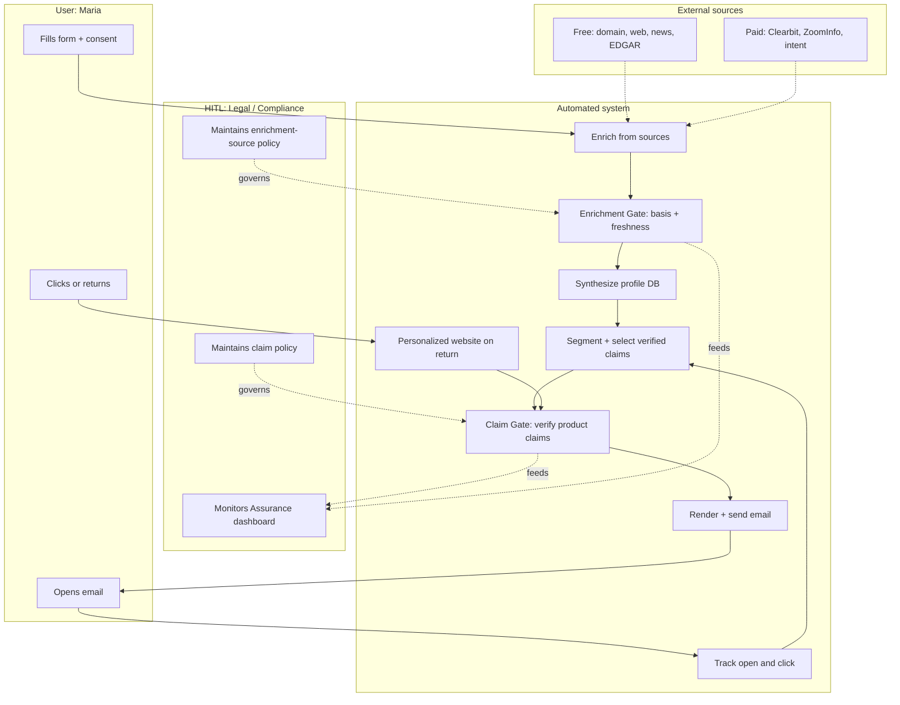
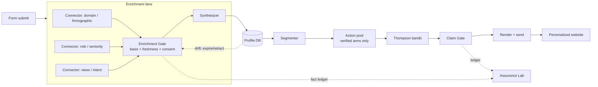
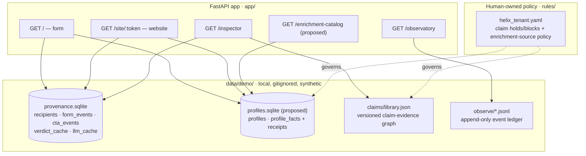

# Enrichment, touchpoints & the human-in-the-loop — a step-by-step explainer

> Status: **design + recommendation. Not built yet.** This answers the operator's
> 2026-06-18 ask (enrich the form data from other sources, synthesize a profile DB,
> personalize the email + return-visit website, catalog paid/free sources, make it readable
> in observability, ground it in diagrams, push back and recommend). PRD amendment **A2**
> points here. Two decisions at the end gate the build.

---

## 0. Read this first — the pushback (you asked me to)

Provenance's whole promise is **"outreach that can't say what it can't prove."** Today that
promise is about *claims* — every sentence about Helix Analytics is verified against an
approved source before it ships.

The new ask ("synthesize personalized data from other sources and put it in the message")
quietly changes the subject from **what we say** to **what we know about the recipient** —
and if we're not careful it *breaks the promise it's supposed to extend*. Three concrete
problems:

1. **It re-introduces the exact failure mode the product attacks — just on a different
   axis.** An unverified product claim and an unverified *fact about Maria* ("your 12
   facilities", "your value-based-care initiative") are the same risk: shipping something
   you can't substantiate. If enrichment data flows into the copy unchecked, we've built a
   Gate for product claims and left the side door wide open for personal claims.
2. **Regulated health-tech makes this not-optional.** The recipients are clinicians and
   hospital execs. Enriching and messaging them pulls in CAN-SPAM, GDPR/ePrivacy (if any are
   EU), CCPA/CPRA, and each data vendor's acceptable-use terms. "We bought it from ZoomInfo"
   is **not** a lawful basis by itself. Using enriched personal data with no recorded basis
   is precisely the kind of thing the Assurance Lab exists to catch — so it must be *inside*
   the boundary, not bolted on outside it.
3. **The locked PRD says "no real PII, 100% synthetic, real email out of scope."** This ask
   crosses that line. That's fine — operators can amend — but it's a deliberate decision,
   logged (A2), not a silent drift.

There's also a softer risk: **personalization-creep erodes the trust the product sells.** A
cold email that recites facts the recipient never gave you ("we see Northwind runs Epic
across 12 sites") reads as surveillance, not service. The brands that win regulated outreach
personalize *restraint*, not omniscience.

**I'm not saying don't do it. I'm saying do it the Provenance way.**

---

## 1. The recommendation — enrichment is a provenance problem too

Apply the **same discipline** to enrichment data that the Gate already applies to claims.
The Claims Library becomes the pattern for a **Profile Library**:

| Claims (today) | Profile facts (proposed) |
|---|---|
| a claim is bound to a **source span** | a fact is bound to its **source connector** |
| a claim carries a **source_version** (drift) | a fact carries a **fetched_version + TTL** (staleness) |
| compliance **rules** can veto a claim | a **lawful-basis / consent** check can veto a fact |
| the **Gate** decides green/amber/red | an **Enrichment Gate** decides usable/needs-disclaimer/blocked |
| blocked claims never enter the bandit pool | blocked facts never reach the renderer |
| **Drift** re-verifies on source change | **Drift** drops a fact when its source retracts/expires |

Two specific recommendations on top of that mirror:

- **R-a (recommended): enrichment drives SELECTION, not fabricated copy.** Enriched facts
  decide *which verified claims* to show and the tone/segment — they do **not** get inlined
  as new personal assertions. Maria's "value-based-care" signal makes us lead with the
  *already-verified* outcomes claim instead of the security claim. The copy still contains
  only Gate-passed product claims. This keeps "can't say what it can't prove" literally true
  while still feeling personal. (The alternative — facts in the copy — is **Fork 1** below.)
- **R-b (recommended): the demo stays synthetic + offline + $0.** We **catalog** the real
  paid/free sources honestly (section 6) and build **simulated connectors** that emit
  synthetic facts with realistic shape, latency, basis, and TTL. No real PII, no paid calls,
  no key — same guarantees as today. A "live connector" mode is a later, opt-in switch.

---

## 2. Plain-English walkthrough (one person, end to end)

Meet **Maria Chen — VP Clinical Operations at Northwind Health**, a regional health system.

1. **She fills the form.** Name, work email, company, role (`clinops`), size (`idn`),
   region, use-case, urgency, and a **consent** checkbox. That's the only data she *gave* us.
   → saved as a `Recipient`.
2. **The system enriches — automatically.** It fans out to a handful of sources, each
   answering one question: *Who is Northwind? What is Maria's role seniority? Any public
   signal she's in-market?* Each answer comes back as a **fact with a receipt**: the value,
   *where it came from*, *the lawful basis*, *how fresh it is*, and a confidence.
3. **Each fact passes the Enrichment Gate.** Facts with consent + an allowed source + that
   aren't stale are **usable**. A fact we can't justify (no basis, expired, disallowed
   vendor) is **blocked** — it never reaches the message. Same red/amber/green idea as claims.
4. **The usable facts are synthesized into a profile** and written to the **profile DB**.
5. **Segmentation + claim selection.** The profile refines Maria's segment and tells the
   optimizer *which verified claims are most relevant* — here, the ROI/outcomes claim, not
   the security one.
6. **The email is rendered and run through the same Gate.** Only verified product claims
   ship. The "personal" part is the greeting, the company name she gave us, and *which*
   verified claims we chose — not invented facts about her.
7. **Send + track (simulated).** We log the send, the open, and the click.
8. **She clicks / comes back.** The magic link opens her **personalized website**. The
   system re-pulls a *fresh* profile (if a news fact expired or was retracted, it's gone —
   that's Drift), re-runs the **same Gate**, shows the A/B-winning verified variant, tracks
   the CTA, and feeds the result back to the optimizer.

The thread to hold onto: **every box above either uses data the user gave us, or data with a
recorded receipt that passed a gate.** Nothing un-receipted ever reaches Maria.

---

## 3. Who does what — the human-in-the-loop (HITL)

You guessed the shape exactly. Humans own **two policy documents** and **watch one
dashboard**. Everything else runs unattended.

| Touched by a human? | What | Cadence | Why a human |
|---|---|---|---|
| ✋ **HITL** | **Claim policy** — the Claims Library + compliance rules (`rules/helix_tenant.yaml`): what's approved, what's on legal hold | When sources change or legal acts | Judgment: what may we assert, and when must we stop |
| ✋ **HITL** | **Enrichment-source policy** — which connectors are allowed, the lawful basis per source, TTLs | When adding a vendor / on a privacy review | Judgment: what data may we *use*, on what basis |
| 👁 **Monitor** | **Assurance dashboard** — catch-rate vs baseline, false-reject, calibration, drift log | Continuous glance | Trust: confirm the automated boundary is holding |
| 🤖 Automated | enrichment, fact-gating, synthesis, segmentation, claim verification, bandit optimization, drift re-verification, render, send, track, return-visit personalization | Per event, 24/7 | Volume: this is the 100k-messages part no human can read |

The key idea — the same one that makes the Gate valuable — is that **humans review the
*policy* once, not the *messages* 100,000 times.** Two policy gates + one dashboard is the
entire human surface.

### Process diagram — swimlanes



---

## 4. The touchpoints, organized

Five touchpoints, each with a clear data-in / processing / data-out (the WORKFLOW.md style).

| # | Touchpoint | Data in | Processing | Data out | Where it lands |
|---|---|---|---|---|---|
| T1 | **Form submit** | what the user typed + consent | validate, create `Recipient` | recipient record | `provenance.sqlite › recipients` |
| T2 | **Enrich + synthesize** | recipient + connector responses | fan-out → fact receipts → Enrichment Gate → merge | gated profile | `profiles.sqlite › profiles, profile_facts` |
| T3 | **Compose + send** | profile + verified claim pool | segment → bandit selects verified arm → Claim Gate → render | sent email + ledger | `provenance.sqlite › cta_events` + claim ledger |
| T4 | **Track** | open pixel, click | attribute to recipient + variant | engagement signal → bandit reward | `provenance.sqlite › cta_events` |
| T5 | **Return / website** | magic-link token | re-pull fresh profile (drift) → same Gate → A/B winner → CTA | personalized page + CTA | `provenance.sqlite › cta_events` |

### Sequence diagram — the full touchpoint timeline

```mermaid
sequenceDiagram
  participant Maria
  participant Form
  participant Enrich as Enrichment + Gate
  participant DB as Profile DB
  participant Opt as Segment + Bandit
  participant Gate as Claim Gate
  participant Email
  participant Web as Personalized site

  Maria->>Form: submit + consent
  Form->>DB: save Recipient
  Form->>Enrich: enrich(recipient)
  Enrich->>Enrich: fan-out to sources, gate each fact
  Enrich->>DB: write usable facts + receipts
  DB->>Opt: synthesized profile
  Opt->>Gate: candidate verified claims for segment
  Gate->>Email: render only Gate-passed claims
  Email->>Maria: personalized email
  Maria->>Email: open + click
  Email->>Opt: engagement reward
  Maria->>Web: magic-link return
  Web->>DB: re-pull fresh profile
  Web->>Gate: same Gate, post-drift boundary
  Gate->>Web: A/B-winning verified variant
  Web->>Opt: CTA reward
```

---

## 5. The agent / node graph — enrichment as an extension of the Gate graph

The existing Observatory node graph (`pipeline/common/topology.py`) gains an **enrichment
lane** that sits *before* the optimizer and reuses the Gate discipline.



Note the two dotted edges: **Drift** now also expires stale/retracted *facts* (not just
claims), and the **Assurance Lab** now also audits the *fact* ledger — so the human's single
dashboard covers both gates.

---

## 6. The enrichment data catalog — every source, paid and free

This is the content behind the "page showing all the data we can enrich with." Each row:
what it gives, cost model, the realistic **lawful basis** question, and freshness. **In the
demo, every one of these is a *simulated* connector emitting synthetic facts** (R-b).

### Free / low-cost sources (between form → email)

| Source | Gives us | Basis / caution | Freshness |
|---|---|---|---|
| Email domain parse | company domain, B2B-vs-personal | low risk (user gave the email) | instant |
| MX / DNS / WHOIS | mail provider, domain age, registrar | public | days |
| Company website scrape | products, locations, "about", tech hints | ToS varies; respect robots.txt | weeks |
| News / RSS / Google News | recent events, funding, initiatives | public; attribute | hours |
| SEC EDGAR (US filings) | revenue, risk factors (public cos) | public record | quarterly |
| GitHub / job boards | tech stack, hiring signals | public; ToS | days |
| LinkedIn public profile | title, seniority (no scraping at scale) | **ToS-restricted** — careful | weeks |
| Clearbit Logo / free tier | logo, basic firmographic | free tier limits | weeks |
| BuiltWith free | website tech stack | free tier | weeks |
| Google Maps / Places | locations, # sites | API quota | months |

### Paid sources (between form → email, and for return-visit refresh)

| Source | Gives us | Cost model | Basis / caution | Freshness |
|---|---|---|---|---|
| Clearbit / HubSpot Enrichment | firmographics, role, seniority | per-enrichment / seat | vendor AUP + your basis | weeks |
| ZoomInfo | contact + company, org chart | seat + credits ($$$) | **AUP is strict**; record basis | weeks |
| Apollo.io | contact + intent | seat + credits | AUP | weeks |
| People Data Labs | person/company graph | per-record API | basis required | weeks |
| Cognism / Lusha | EU-compliant B2B contacts | seat + credits | GDPR-positioned | weeks |
| 6sense / Demandbase | account intent, buying stage | platform ($$$$) | account-level, lower PII risk | days |
| Bombora | topic surge / intent | subscription | account-level | weekly |
| FullContact | identity resolution | per-API | basis required | weeks |
| Datanyze / Slintel | technographics | seat | AUP | weeks |

### Between email-sent → click → website (engagement enrichment)

| Source | Gives us | Basis / caution |
|---|---|---|
| Email open pixel | opened? when? client? | disclose tracking; some block it |
| Click tracking (wrapped links) | which CTA, when | first-party, low risk |
| Website analytics (first-party) | pages, dwell, return | first-party cookie + notice |
| Reverse-IP (KickFire/Clearbit Reveal) | company of an anonymous visit | account-level, no PII |
| UTM / referrer | channel attribution | first-party |

**The honest read:** the *account-level intent* sources (6sense, Bombora, reverse-IP) are
both the most useful for "which verified claim to lead with" **and** the lowest personal-data
risk, because they're about the *company's* behavior, not Maria's. That's where I'd start.

---

## 7. Where the data lives (DB locations) — architecture



Every store is **local, synthetic, and gitignored** — the demo's $0/offline/no-PII
guarantee is preserved. The Observatory's existing API (`/api/observe/*`) gains a
`profiles` view so the profile DB and its receipts are readable on the dashboard, with the
on-screen note "synthetic — connectors simulated" and the file path shown.

---

## 8. Technical details (after the plain English)

**Schemas (proposed, mirror `pipeline/common/schemas.py`):**

```text
ProfileFact   { fact_id, recipient_id, key, value, source, source_kind(free|paid|first_party),
                lawful_basis, fetched_version, ttl_seconds, confidence,
                verdict(usable|disclaimer|blocked), reasons[] }
Profile       { recipient_id, segment_refined, facts[ProfileFact], synthesized_at,
                signals{ intent_topic, in_market, account_tier } }
```

**Connectors:** a `Connector` protocol with `fetch(recipient) -> list[RawFact]`; the demo
ships `SimDomainConnector`, `SimRoleConnector`, `SimIntentConnector` returning deterministic
synthetic facts keyed off the recipient (stable hash, like the CTA oracle — reproducible).
A `live=True` mode (later, opt-in) swaps in real HTTP connectors behind the same protocol.

**Enrichment Gate:** `enrichment_gate.evaluate(fact) -> verdict` checking (1) consent on the
recipient, (2) source in the allowed-list from `rules/helix_tenant.yaml`, (3) not expired
(`fetched_version` age < `ttl`). Blocked facts are dropped before synthesis. Emits the same
observe events (`INPUT/DECISION/OUTPUT`) on a new `enrichment` lane, so it shows up in the
Observatory timeline and node graph automatically.

**Observability:** a new `enrichment` lane + connector/gate/synthesizer nodes in
`topology.py`; the trace driver records them; `/api/observe/profiles` serves the profile DB
read-only; the dashboard adds a "Profiles" panel and an "Enrichment catalog" page.

**Drift:** `DriftMonitor` gains `expire_fact` / `retract_fact` triggers that drop a fact and,
if it fed a selection, re-segment — reusing the surgical-re-verify machinery.

**Tests (must, per the working agreement — not weakened):** an Enrichment Gate property
(a no-basis fact is always blocked); a determinism test (synthetic enrichment is
byte-identical); a parity test (a blocked fact never appears in any rendered message);
extend P4 to cover personalization. pytest stays the authoritative gate.

---

## 9. Two decisions before I build (Forks)

**Fork 1 — How far does enriched data go into the message?**
- **A (recommended):** enrichment drives *claim selection, segment, and tone only*; the copy
  contains only Gate-passed product claims + the data the user gave us. Keeps the promise
  literally intact; lowest compliance risk.
- **B:** enriched personal facts may appear *in the copy*, but each must pass the Enrichment
  Gate **and** carry an on-file basis, and the Assurance Lab audits them. More "wow", real
  compliance + creepiness exposure.

**Fork 2 — How real is the enrichment?**
- **A (recommended):** simulated connectors + synthetic facts; real sources are *cataloged*
  only. Keeps $0/offline/no-PII/byte-identical. Build is self-contained.
- **B:** wire one real free connector now (e.g., email-domain + public news). Needs a network
  carve-out and a privacy note; breaks pure determinism for that fact.

My recommendation: **1-A + 2-A** — it's the version that *strengthens* the thesis instead of
quietly contradicting it, ships at $0, and leaves a clean opt-in path to "live" later.
