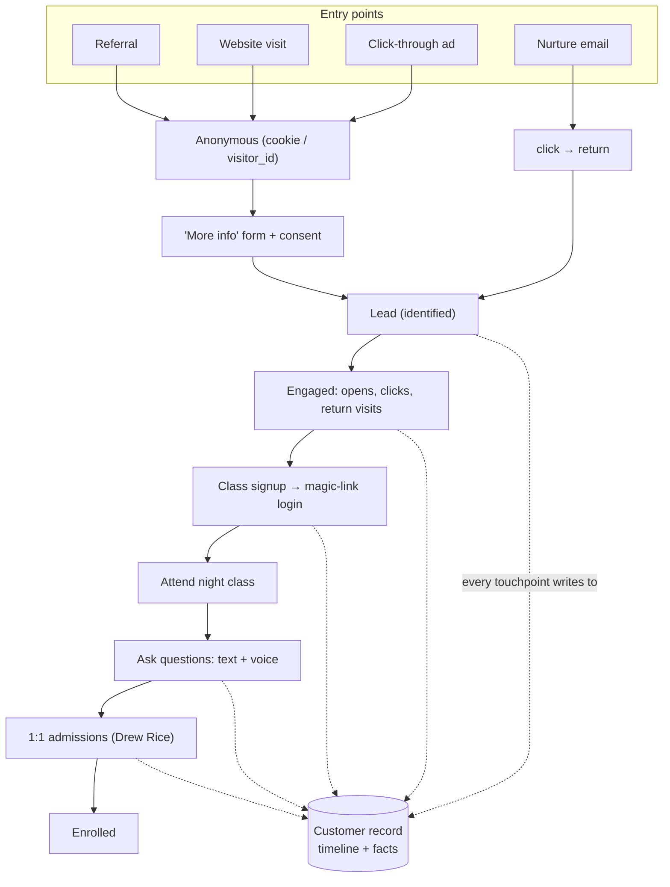

# The funnel, the customer record & the surface policy

> A new **education/enrollment tenant** on the Provenance engine ("tenant = config").
> Built: the customer timeline, identity stitching, the magic-link class login, in-class
> text+voice Q&A capture, admissions notes, the **surface-policy** gate, and the funnel
> test suite (`tests/test_funnel.py`, 9 paths). Design + pushback below. DECISIONS R17.

---

## 0. The pushback (you asked for it)

1. **This is education, not Helix.** Night classes + an admissions officer don't fit the
   locked health-tech tenant — so we made it a **new tenant on the same engine**, not a
   rewrite. Helix stays intact.
2. **Two different problems, federated — not merged.** "Can't say what it can't prove"
   (what *we* say → the Gate) vs. "know the customer" (what *we know about them* → this
   customer record). The record *feeds* personalization; the same provenance discipline
   (source + basis + freshness) governs customer facts, plus one new dimension below.
3. **"Creepiness" is made structural, not a vibe.** Every fact carries a **surface policy**
   — `say` / `allude` / `hold` — so "know it but don't mention it; use adjacent topics" is
   an auditable rule, not a rep's discretion. (§3)
4. **Voice/in-class capture is sensitive** → consent at signup, and those facts default to
   `allude`, never `say`.
5. **The class login = a magic link** (passwordless) — the *same* opaque token the
   personalized website uses, so one identity spans the whole funnel.

---

## 1. The funnel — every entry, every stage

Each touchpoint (`pipeline/customer/funnel.py`) appends a **TouchpointEvent** and derives
**facts**:

| Touchpoint | Captures | Example fact | Default surface |
|---|---|---|---|
| `ad_click` | campaign/creative | `interest:*` | allude (behavioral) |
| `web_signup` | declared goal, background, **consent** | `goal`, `background` | **say** |
| `email_event` | open/click | `engagement:email_*` | allude |
| `web_return` | class viewed | `interest:class_viewed` | allude |
| `class_signup` | which class → **issues magic-link token** | `intent:class` | **say** |
| `class_attend` | attended / minutes | `engagement:attended` | allude |
| `class_question` (text) | the question content | `interest:career_outcomes` … | **say** |
| `class_question` (voice) | transcribed question | same topics | allude |
| `admissions_note` (Drew Rice) | rep observation | any topic | allude · **hold** if sensitive |

## 2. One record, two views

A **Customer** = identity (`visitor_id` → `email` → `magic_token`) + a timeline + facts.
Identity is stitched as the journey proceeds; `CustomerStore.resolve()` re-stitches across
sessions (anonymous click today, signup tomorrow = one record).

- **Rep view** (`rep_briefing`) — the 1:1 surface for an admissions officer: `say` facts to
  reference, `allude` facts each with a generated **adjacent-topic opener**, `hold` facts
  greyed (internal only), plus the timeline.
- **Automated view** (`mass_personalization`) — only `say` facts may be inlined in mass
  copy; `allude` facts may *silently steer* which class/claim is featured; `hold` is withheld.
  This feeds the existing Enrichment-Gate personalization.

## 3. The surface policy (the anti-creepiness control)

| Policy | A 1:1 rep may… | In mass copy / website |
|---|---|---|
| **say** | reference it directly ("I saw you asked about job placement") | may be inlined (with its receipt) |
| **allude** | NOT state it — raise an *adjacent topic* that opens the door | never literal; may steer selection |
| **hold** | never surface or allude | never used |

Derived (tenant config, `rules/academy_tenant.yaml › surface_policy`) from **consent**
(none → hold) + **source** (declared = say; behavioral/voice/rep-note/3rd-party = allude) +
**sensitivity** (health/family/finances/etc. → hold). Re-evaluated when consent changes, so
signing up *unlocks* prior anonymous behavioral data to `allude`.

## 4. What proves it works — `tests/test_funnel.py` (9 paths)

ad→signup (consent unlock) · class signup issues the login · text=say / voice=allude ·
admissions note allude, sensitive=hold · **the creepiness invariant** (no `hold` fact ever
reaches mass copy or a rep's `say`; behavioral always `allude`) · allude facts carry an
opener · no-consent holds everything · identity resolution (visitor/email/token → one id) ·
deterministic replay.

## 5. Where the data lives
`customers.sqlite` — customers + a flattened, queryable `facts` table (collect all info by
customer in one query). Local, gitignored, env-overridable (`PROVENANCE_CUSTOMERS_DB_PATH`)
for a deploy volume.

## 6. Not built yet (honest)
Real ad/email integrations, live voice transcription (the capture is modeled; wire a real
STT later), and a **rep-briefing UI page** (the view is a function today). The funnel
*logic* + the safety invariants are built and tested; the connectors and the rep screen are
the next layer.
