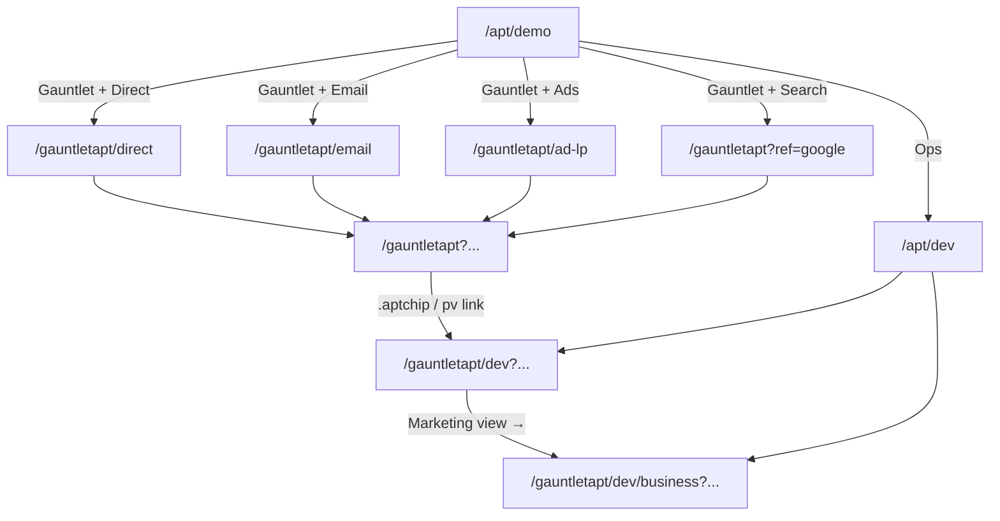

# Demo Navigation Plan — Gauntlet / Planet

**Status:** Plan only (no implementation in this session)  
**Written:** 2026-07-10  
**Audience:** Implementors, QA, test-theater / browser automation authors  

This document specifies the **visitor demo tour** navigation layer on top of the existing personalization engine. It does **not** replace `classify_entry()`, `build_page()`, or the `/dev` consoles — it curates entry URLs and click paths into them.

**Read first:** `docs/05-build/GAUNTLET-CONSOLE-HANDOFF.md` for deploy workflow, mount prefixes, and console architecture.  
**Generation workflow:** `docs/05-build/GENERATION-PROMPT-WORKFLOW.md` — as-built copy vs image lanes, pushback on the five-step model, console stage mapping.

---

## A. Architecture summary

### Two planes

| Plane | Entry | Audience | Purpose |
|-------|-------|----------|---------|
| **Visitor demo tour** | `/apt/demo` → channel galleries → live replica | Sales, prospects, product reviewers | Walk through realistic arrival scenarios (ads, email, search, direct) and see personalized copy on the replica |
| **Ops console** | `/apt/dev` → tenant `/dev` or `/dev/business` | Engineers, marketers, demo operators | Decision trace, process map, staged YAML diffs, delivery inventory |

The tour plane links **into** the ops plane via `console_deep_link` patterns on every scenario card. Audience tabs on gallery pages (`Business` / `Consumer` for Gauntlet; `Enterprise` / `Self-serve` for Planet) filter **visitor segment** — not engineer vs marketer console.

### Route map

**Production base:** `https://johnnycchung.com` (Vercel → Railway rewrite for `/gauntletapt`, `/planetapt`, `/apt/*`)

#### Existing (ship today)

| Route (portal) | Route (local legacy) | Channel / role |
|----------------|----------------------|----------------|
| `/gauntletapt` | `/gauntlet` | Live replica (all channels resolve here) |
| `/gauntletapt/ad-lp` | `/gauntlet/ad-lp` | Ads gallery — 12-variant X grid |
| `/gauntletapt/ad?v=…` | `/gauntlet/ad?v=…` | Single ad mockup |
| `/gauntletapt/dev` | `/dev` | Engineer console |
| `/gauntletapt/dev/business` | `/dev/business` | Marketer console |
| `/gauntletapt/dev/image-decisions` | `/dev/image-decisions` | Image pipeline guide |
| `/planetapt` | `/planet` | Live replica |
| `/planetapt/ads` | `/planet/ads` | Ads gallery — 12 full X mockups |
| `/planetapt/ads-lp` | `/planet/ads-lp` | LP variant previews |
| `/planetapt/ad?v=…` | `/planet/ad?v=…` | Single ad mockup |
| `/planetapt/dev` | `/planet/dev` | Engineer console (+ Location stage) |
| `/planetapt/dev/business` | `/planet/dev/business` | Marketer console |
| `/apt/dev` | `/apt/dev` | Ops hub — site picker + console deep-links |

#### Proposed (this plan)

| Route (portal) | Purpose |
|----------------|---------|
| `/apt/demo` | **Demo sitemap** — tenant picker + four channel tiles (Ads, Direct, Email, Search) |
| `/gauntletapt/direct` | Direct-entry gallery — curated scenarios + audience tabs |
| `/gauntletapt/email` | Email-entry gallery — HubSpot-style cards + magic-token links |
| `/planetapt/direct` | Planet direct gallery |
| `/planetapt/email` | Planet email gallery |

Galleries are **curated scenario cards** pointing at existing landing URLs. No new personalization logic — only navigation + copy framing.

### Data richness per channel

Richness increases left → right in how much first-party + CRM context arrives with the click:

```
direct  <  search  <  ads  <  email (+ CRM / magic token)
```

| Channel | Signals at arrival | Identity | Typical demo story |
|---------|-------------------|----------|-------------------|
| **Direct** | IP tier, network type, daypart | Cookie login only | Anonymous cold visit; corporate IP → B2B emphasis |
| **Search** | `?ref=google` or search Referer | Cookie login | Intent-neutral copy; IP layer does the work |
| **Ads** | Full UTM stack + `utm_content=vNN` | Cookie or pre-set UTMs | Message-match hero to ad variant / campaign |
| **Email** | `utm_medium=email` + optional `e=` magic token | Token → cohort CRM without login | Warm copy; Liam/Kofi identified pre-login |

### State model (unchanged)

All pages remain deterministic functions of:

- Query params (UTM, `ref`, `e`, `ip`, `as`)
- One cookie per tenant (`gauntlet_email`, `planet_email`)
- Optional `as=anon|known` on **console** routes only (identity preview)

Entry classification (`classify_entry()` in `gauntlet_site.py` / `planet_site.py`) already handles all four channels. Galleries only assemble canonical query-string URLs.

### Navigation flow (target)



---

## B. Phased implementation plan

### Phase 1 — Scenario catalog + demo sitemap

**Goal:** Canonical demo entry at `/apt/demo` driven by `rules/demo_scenarios.yaml`.

| Item | Detail |
|------|--------|
| **Files to add** | `rules/demo_scenarios.yaml`, `pipeline/personalization/demo_nav.py` (loader), `app/apt_demo.py`, `app/templates/apt_demo_sitemap.html` |
| **Files to touch** | `app/server.py` or route registration, `app/templates/_nav.html` (link to `/apt/demo`), `tests/test_demo_nav.py` (stubs) |
| **Acceptance criteria** | `/apt/demo` returns 200; shows Gauntlet + Planet; four channel tiles per tenant link to correct gallery or existing ads route; YAML loads without error; every scenario `id` is unique |
| **Deploy notes** | Add Vercel rewrite for `/apt/demo` → Railway (same pattern as `/apt/dev`). No cache warm required. `pytest tests/test_demo_nav.py -q` before `railway up`. |

### Phase 2 — Direct + email galleries

**Goal:** Per-tenant gallery pages for Direct and Email channels.

| Item | Detail |
|------|--------|
| **Files to add** | `app/templates/demo_channel_gallery.html` (shared), `app/templates/demo_email_card.html` (partial) |
| **Files to touch** | `app/gauntlet.py`, `app/planet.py` (register `/direct`, `/email` on both mounts), `pipeline/personalization/demo_nav.py` (filter scenarios by tenant + channel + audience), `MOUNTS` dicts (add `direct_gallery`, `email_gallery` keys) |
| **Acceptance criteria** | `/gauntletapt/direct` and `/gauntletapt/email` return 200; Business/Consumer tabs filter cards; each card opens replica with exact `landing_url`; email cards show HubSpot-style metadata (campaign, recipient hint); Planet parallels work |
| **Deploy notes** | Static templates only — deploy via `railway up`. Verify portal mount hrefs use `/gauntletapt/...` not legacy `/gauntlet/...`. |

### Phase 3 — Wire navigation + cross-links

**Goal:** Tour plane links into ops plane consistently; breadcrumbs and back-links.

| Item | Detail |
|------|--------|
| **Files to touch** | All gallery templates, `apt_demo_sitemap.html`, `gauntlet_ad_lp.html` (add “← Demo sitemap”), `gauntlet_site.html` (optional slim demo nav), `apt_dev_hub.html` (link to `/apt/demo`), `gauntlet_dev.html` / `planet_dev.html` (entry simulation block already exists — add gallery links) |
| **Acceptance criteria** | Every gallery page links back to `/apt/demo`; replica `.aptchip` preserves query string to `/dev`; `console_deep_link` from YAML matches live hrefs; `as` param preserved hub → console (existing behavior, regression-tested) |
| **Deploy notes** | Full `test_gauntlet_site.py` + `test_planet_site.py` + `test_demo_nav.py` green. |

### Phase 4 — Marketer console restructure (deferred)

**Goal:** `/dev/business` becomes the primary ops entry for marketers; engineer view tucks under “Technical view →”.

| Item | Detail |
|------|--------|
| **Files to touch** | `gauntlet_dev_business.html`, `planet_dev_business.html`, `apt_dev_hub.py` (card ordering), sidebar IA |
| **Acceptance criteria** | Marketer console is default card on `/apt/dev`; 8-section sidebar unchanged in substance; staged drawer still works |
| **Deploy notes** | Coordinate with `GAUNTLET-CONSOLE-HANDOFF.md` §9 — copy-policy YAML is a separate follow-up |

### Phase 5 — Test theater + browser workflows (deferred)

**Goal:** `docs/workflows.json` entries mirroring Section D workflow IDs; optional agent-browser replay against production.

| Item | Detail |
|------|--------|
| **Files to add** | `docs/workflows.json`, `tests/test_demo_nav_e2e.py` (optional, marked `@pytest.mark.e2e`) |
| **Acceptance criteria** | Each `WF-DEMO-*` has a pytest stub or e2e test; workflow runner can replay against `johnnycchung.com` |
| **Deploy notes** | E2E tests run outside CI by default (network-dependent) |

### Phase 6 — Google/Meta ad platform stubs (deferred)

**Goal:** Full Google Ads / Meta Ads Manager gallery stubs mirroring the X ad grid.

| Item | Detail |
|------|--------|
| **Status** | **Deferred** — not in v1 scope; X grid + ad-lp covers paid-social demo needs |
| **Reason** | No new personalization logic required; stubs are navigation-only mockups with high design cost |
| **When to revisit** | After Phase 3 cross-links ship and sales requests multi-platform ad walkthrough |

---

## C. Scenario catalog spec

### File location

`rules/demo_scenarios.yaml` — **navigation scenarios** for the tour plane.

> **Name collision note:** `pipeline/personalization/demo_scenarios.py` is the legacy **bandit / clone** demo (3 scenarios × variants). The YAML file is a **different catalog** for Gauntlet/Planet entry tours. Loader: `pipeline/personalization/demo_nav.py` (new). Do not merge into `demo_scenarios.py`.

### YAML schema

```yaml
# rules/demo_scenarios.yaml
version: 1
tenants:
  - gauntlet
  - planet

# Audience segment keys (per-tenant label mapping in demo_nav.py)
# gauntlet: business → companies | consumer → individuals
# planet:   business → enterprise | consumer → selfserve

scenarios:
  - id: string          # unique, e.g. g-direct-anon-tier0
    tenant: gauntlet | planet
    channel: direct | search | ads | email
    audience: business | consumer | all   # all = shown on both tabs
    title: string       # card headline
    story: string       # 1–2 sentence sales narrative on the gallery card
    query_params:       # merged into landing URL (dict)
      utm_source: ...
      ref: ...
      e: ...            # magic token literal or ${magic:liam} template
    ip_override: null | string   # ?ip= value; null = offline tier 0
    identity_hint: anon | known | token_liam | token_maya | login_maya | ...
    landing_url_pattern: "{mount_page}{query}"   # template vars
    console_deep_link_pattern: "{mount_dev}{query}&as={as}"
    tags: []            # optional: corporate, return-visitor, location, prebuild
    featured: false     # pin to top of gallery
```

#### Template variables

| Variable | Resolves to |
|----------|-------------|
| `{mount_page}` | `/gauntletapt` or `/planetapt` (portal) |
| `{mount_dev}` | `/gauntletapt/dev` or `/planetapt/dev` |
| `{mount_dev_business}` | `.../dev/business` |
| `{query}` | URL-encoded `query_params` + `ip_override` |
| `{as}` | `anon` or `known` from `identity_hint` |
| `${magic:liam}` | `CO.magic_token(CO.BY_ID["liam"])` at load time |
| `${magic:kofi}` | Planet cohort magic token |

### Example entries

```yaml
version: 1
tenants: [gauntlet, planet]

scenarios:
  # ── Gauntlet · Direct ──────────────────────────────────────────────
  - id: g-direct-anon-tier0
    tenant: gauntlet
    channel: direct
    audience: consumer
    title: "Cold visit — no signals"
    story: "Typed the URL. No UTMs, no login. IP layer is the only hint (tier 0 offline)."
    query_params: {}
    ip_override: null
    identity_hint: anon
    landing_url_pattern: "{mount_page}"
    console_deep_link_pattern: "{mount_dev}?as=anon"
    tags: [tier0, anonymous]
    featured: true

  - id: g-direct-corp-tier2
    tenant: gauntlet
    channel: direct
    audience: business
    title: "Corporate IP — Apple office"
    story: "Anonymous visitor from a resolved corporate netblock. Firmographic copy may allude; never recites employer."
    query_params: {}
    ip_override: "17.253.144.10"
    identity_hint: anon
    landing_url_pattern: "{mount_page}?ip=17.253.144.10"
    console_deep_link_pattern: "{mount_dev}?ip=17.253.144.10&as=anon"
    tags: [corporate, tier2, apple]
    featured: true

  - id: g-direct-known-return
    tenant: gauntlet
    channel: direct
    audience: consumer
    title: "Known return — Maya logged in"
    story: "Direct revisit with CRM cookie. Welcome-back say-level copy; Vector employer stays allude."
    query_params: {}
    ip_override: null
    identity_hint: login_maya
    landing_url_pattern: "{mount_page}"
    console_deep_link_pattern: "{mount_dev}?as=known"
    tags: [return-visitor, crm]
    featured: false

  # ── Gauntlet · Email ─────────────────────────────────────────────────
  - id: g-email-liam-token
    tenant: gauntlet
    channel: email
    audience: consumer
    title: "HubSpot cohort — Liam (magic link)"
    story: "April cohort email with embedded token. Identified pre-login; abandoned-application objection may surface on console only."
    query_params:
      utm_source: hubspot
      utm_medium: email
      utm_campaign: cohort-april
      e: "${magic:liam}"
    ip_override: null
    identity_hint: token_liam
    landing_url_pattern: "{mount_page}?utm_source=hubspot&utm_medium=email&utm_campaign=cohort-april&e=${magic:liam}"
    console_deep_link_pattern: "{mount_dev}?utm_source=hubspot&utm_medium=email&utm_campaign=cohort-april&e=${magic:liam}&as=known"
    tags: [hubspot, magic-token, liam]
    featured: true

  - id: g-email-maya-known
    tenant: gauntlet
    channel: email
    audience: business
    title: "Known exec — Maya (logged in + email UTMs)"
    story: "Email channel classification with active session. Say-level name + declared goals; Cedar Health employer never recited."
    query_params:
      utm_source: hubspot
      utm_medium: email
      utm_campaign: catalyst-nurture
    ip_override: null
    identity_hint: login_maya
    landing_url_pattern: "{mount_page}?utm_source=hubspot&utm_medium=email&utm_campaign=catalyst-nurture"
    console_deep_link_pattern: "{mount_dev}?utm_source=hubspot&utm_medium=email&utm_campaign=catalyst-nurture&as=known"
    tags: [hubspot, maya, b2b]
    featured: false

  # ── Gauntlet · Ads (reference existing catalog) ────────────────────────
  - id: g-ads-v09-keyword
    tenant: gauntlet
    channel: ads
    audience: business
    title: "X keyword ad — v09 AI hiring"
    story: "Paid click with utm_content=v09. Hero message-matches keyword targeting."
    query_params:
      utm_source: x
      utm_medium: paid
      utm_campaign: x-keyword-ai-hiring
      utm_content: v09
    ip_override: null
    identity_hint: anon
    landing_url_pattern: "{mount_page}?utm_source=x&utm_medium=paid&utm_campaign=x-keyword-ai-hiring&utm_content=v09"
    console_deep_link_pattern: "{mount_dev}?utm_source=x&utm_medium=paid&utm_campaign=x-keyword-ai-hiring&utm_content=v09&as=anon"
    tags: [v09, keyword, prebuild]
    featured: true

  - id: g-search-google
    tenant: gauntlet
    channel: search
    audience: all
    title: "Organic search — Google referrer"
    story: "Simulated search arrival via ?ref=google. Intent-neutral hero; IP tier drives emphasis."
    query_params:
      ref: google
    ip_override: null
    identity_hint: anon
    landing_url_pattern: "{mount_page}?ref=google"
    console_deep_link_pattern: "{mount_dev}?ref=google&as=anon"
    tags: [search]
    featured: false

  # ── Planet · Direct ────────────────────────────────────────────────────
  - id: p-direct-anon-tier0
    tenant: planet
    channel: direct
    audience: consumer
    title: "Self-serve cold visit"
    story: "Direct hit with no location confidence (offline tier 0). No region line ships."
    query_params: {}
    ip_override: null
    identity_hint: anon
    landing_url_pattern: "{mount_page}"
    console_deep_link_pattern: "{mount_dev}?as=anon"
    tags: [tier0, selfserve]
    featured: true

  - id: p-direct-ag-region
    tenant: planet
    channel: direct
    audience: business
    title: "Ag enterprise — Midwest region"
    story: "Corporate IP with resolved agriculture segment. Location line: 'Every field in {region}, imaged today.'"
    query_params: {}
    ip_override: "19.7.0.1"
    identity_hint: anon
    landing_url_pattern: "{mount_page}?ip=19.7.0.1"
    console_deep_link_pattern: "{mount_dev}?ip=19.7.0.1&as=anon"
    tags: [location, enterprise, agriculture]
    featured: true

  # ── Planet · Email ───────────────────────────────────────────────────
  - id: p-email-kofi-token
    tenant: planet
    channel: email
    audience: consumer
    title: "Crisis responders — Kofi (magic link)"
    story: "HubSpot crisis-responders campaign. Token identifies Kofi pre-login; relief-org context."
    query_params:
      utm_source: hubspot
      utm_medium: email
      utm_campaign: crisis-responders
      e: "${magic:kofi}"
    ip_override: null
    identity_hint: token_kofi
    landing_url_pattern: "{mount_page}?utm_source=hubspot&utm_medium=email&utm_campaign=crisis-responders&e=${magic:kofi}"
    console_deep_link_pattern: "{mount_dev}?utm_source=hubspot&utm_medium=email&utm_campaign=crisis-responders&e=${magic:kofi}&as=known"
    tags: [hubspot, kofi, response]
    featured: true

  - id: p-email-amara-known
    tenant: planet
    channel: email
    audience: business
    title: "Enterprise agronomy — Amara (logged in)"
    story: "Email channel + CRM session. Enterprise track emphasis; location + archetype on console."
    query_params:
      utm_source: hubspot
      utm_medium: email
      utm_campaign: enterprise-nurture
    ip_override: null
    identity_hint: login_amara
    landing_url_pattern: "{mount_page}?utm_source=hubspot&utm_medium=email&utm_campaign=enterprise-nurture"
    console_deep_link_pattern: "{mount_dev}?utm_source=hubspot&utm_medium=email&utm_campaign=enterprise-nurture&as=known"
    tags: [amara, enterprise]
    featured: false

  # ── Planet · Ads ─────────────────────────────────────────────────────
  - id: p-ads-v01-crop-belts
    tenant: planet
    channel: ads
    audience: business
    title: "X location ad — v01 crop belts"
    story: "Paid social with location targeting creative. Hero + location line message-match."
    query_params:
      utm_source: x
      utm_medium: paid
      utm_campaign: x-location-crop-belts
      utm_content: v01
    ip_override: null
    identity_hint: anon
    landing_url_pattern: "{mount_page}?utm_source=x&utm_medium=paid&utm_campaign=x-location-crop-belts&utm_content=v01"
    console_deep_link_pattern: "{mount_dev}?utm_source=x&utm_medium=paid&utm_campaign=x-location-crop-belts&utm_content=v01&as=anon"
    tags: [v01, location-ad]
    featured: true
```

### Identity hint → test setup

| `identity_hint` | Precondition |
|-----------------|--------------|
| `anon` | Clear tenant cookie; no `as=known` |
| `known` / `login_maya` | `POST /gauntletapt/login` with `maya.chen@gauntletai.com` |
| `login_amara` | `POST /planetapt/login` with `amara.diallo@meridianagronomy.com` |
| `token_liam` | Use magic token in URL; no cookie required |
| `token_kofi` | Planet magic token in URL |

---

## D. Click-by-click workflows

### Conventions

- **Production URLs** unless noted. Local dev: swap `gauntletapt` → `gauntlet`, `planetapt` → `planet`.
- **Preconditions** always include: cookies cleared for tenant under test unless workflow sets login.
- **Step format:** `Action | Target | Expected result`
- **Selectors** from existing templates (verified in repo 2026-07-10).

---

### WF-DEMO-001 — Sitemap tour (Gauntlet, all channels)

| Field | Value |
|-------|-------|
| **Workflow ID** | `WF-DEMO-001` |
| **Preconditions** | Deployed build with Phase 1 shipped; cookies cleared; desktop viewport ≥ 1024px |
| **Starting URL** | `https://johnnycchung.com/apt/demo` |

| Step | Action | Target | Expected result |
|------|--------|--------|-----------------|
| 1 | Navigate | `/apt/demo` | Page title contains “demo”; tenant section visible |
| 2 | Click | Link or tile labeled **GauntletAI** / `gauntletai.com` | Gauntlet channel grid shown (Ads, Direct, Email, Search) |
| 3 | Click | Channel tile **Ads** | Lands on `https://johnnycchung.com/gauntletapt/ad-lp`; heading “X Ads Manager Targeting — 12 Variants” |
| 4 | Navigate back | Browser back or “← Demo” link | Returns to `/apt/demo` Gauntlet channels |
| 5 | Click | Channel tile **Direct** | Lands on `https://johnnycchung.com/gauntletapt/direct`; audience tabs visible |
| 6 | Navigate back | Back | `/apt/demo` |
| 7 | Click | Channel tile **Email** | Lands on `https://johnnycchung.com/gauntletapt/email`; ≥1 HubSpot-style card |
| 8 | Navigate back | Back | `/apt/demo` |
| 9 | Click | Channel tile **Search** | Lands on `https://johnnycchung.com/gauntletapt?ref=google` (or search gallery if added later) |
| 10 | Verify | Replica body | Hero loads; no console chrome; `.aptchip` present linking to `/gauntletapt/dev` |

---

### WF-DEMO-002 — Direct gallery: business vs consumer → corporate IP → marketer console

| Field | Value |
|-------|-------|
| **Workflow ID** | `WF-DEMO-002` |
| **Preconditions** | Phase 2 shipped; cookies cleared |
| **Starting URL** | `https://johnnycchung.com/gauntletapt/direct` |

| Step | Action | Target | Expected result |
|------|--------|--------|-----------------|
| 1 | Navigate | `/gauntletapt/direct` | Gallery page loads; tabs **Business** and **Consumer** (`.aud-tog a` or equivalent) |
| 2 | Click | Tab **Consumer** | Consumer scenarios visible (e.g. “Cold visit”, “Known return — Maya”) |
| 3 | Click | Tab **Business** | Business scenarios visible (e.g. “Corporate IP — Apple office”) |
| 4 | Click | Card **Corporate IP — Apple office** (`href` contains `ip=17.253.144.10`) | Replica at `/gauntletapt?ip=17.253.144.10` |
| 5 | Verify | Replica hero / sections | B2B-leaning emphasis (companies track); no employer name recited as say |
| 6 | Click | `.aptchip` or `sup.pv a` (personalized link) | `/gauntletapt/dev?ip=17.253.144.10` (engineer console) |
| 7 | Verify | `#ch-pipeline` process map | Stage “IP resolve + classify” shows Apple / corporate network |
| 8 | Click | Sidebar link `a.page-link` text **Marketing view →** | `/gauntletapt/dev/business?ip=17.253.144.10&as=anon` |
| 9 | Verify | Marketer console section **Arrival & attribution** | Channel = direct; IP context reflected in audience read |

---

### WF-DEMO-003 — Email gallery: HubSpot card → CRM-aware landing → email channel on console

| Field | Value |
|-------|-------|
| **Workflow ID** | `WF-DEMO-003` |
| **Preconditions** | Phase 2 shipped; cookies cleared; use Liam token scenario |
| **Starting URL** | `https://johnnycchung.com/gauntletapt/email` |

| Step | Action | Target | Expected result |
|------|--------|--------|-----------------|
| 1 | Navigate | `/gauntletapt/email` | Email gallery with HubSpot-styled cards (`.email-card` or similar) |
| 2 | Click | Card **HubSpot cohort — Liam (magic link)** | URL contains `utm_medium=email` and `e=mt_` |
| 3 | Verify | Replica `#hero` / eyebrow | “Welcome back, Liam” (say-level, no login) |
| 4 | Verify | Replica body | “Pinecrest” (employer) **not** present as recited text |
| 5 | Click | `.aptchip` | `/gauntletapt/dev?utm_medium=email&...&e=mt_...` |
| 6 | Verify | `#ch-visitor` entry panel / trace | “Entry classify” disposition = **email**; rule contains `utm_medium=email` |
| 7 | Verify | Plain-English story `.story .row` | Arrival beat mentions email / warm framing |
| 8 | Click | **Marketing view →** | Business console with same query string |
| 9 | Verify | **Arrival & attribution** rows | `utm_medium` = email; identity shows Liam / token path |

---

### WF-DEMO-004 — Ads gallery: ad-lp variant click-through

| Field | Value |
|-------|-------|
| **Workflow ID** | `WF-DEMO-004` |
| **Preconditions** | Cookies cleared |
| **Starting URL** | `https://johnnycchung.com/gauntletapt/ad-lp` |

| Step | Action | Target | Expected result |
|------|--------|--------|-----------------|
| 1 | Navigate | `/gauntletapt/ad-lp` | 12 cards in `.grid`; nav links to Landing, `/dev` |
| 2 | Locate | Card with `utm_content=v09` in `.utm` span | Keyword / AI hiring variant visible |
| 3 | Click | `a.card` for **Keyword targeting** (v09) | `/gauntletapt?utm_source=x&utm_medium=paid&utm_campaign=x-keyword-ai-hiring&utm_content=v09` |
| 4 | Verify | Hero headline | Differs from generic direct visit (keyword message-match) |
| 5 | Verify | `.preview .per` on ad-lp (if navigated back) | Personalized hero text matches replica |
| 6 | Click | Fixed chip `a.chip` text “decisions → /dev” on ad-lp | `/gauntletapt/dev` (may lack UTMs — note for Phase 3 fix) |
| 7 | Re-open | v09 landing URL with full UTMs | `/gauntletapt/dev?utm_source=x&utm_medium=paid&utm_campaign=x-keyword-ai-hiring&utm_content=v09&as=anon` |
| 8 | Verify | Process map ad variant stage | Variant v09 / Keyword targeting fired |

---

### WF-DEMO-005 — Identity preview: anon vs known toggle persistence (hub → console)

| Field | Value |
|-------|-------|
| **Workflow ID** | `WF-DEMO-005` |
| **Preconditions** | Cookies cleared (console uses `as=` override, not cookie) |
| **Starting URL** | `https://johnnycchung.com/apt/dev?site=gauntlet&as=anon` |

| Step | Action | Target | Expected result |
|------|--------|--------|-----------------|
| 1 | Navigate | `/apt/dev?site=gauntlet&as=anon` | `.gd-tog a` shows **Anonymous** with class `on` |
| 2 | Verify | Engineer console card `a.hub-card` href | Contains `as=anon` |
| 3 | Click | `.gd-tog a` **Known (maya.chen@gauntletai.com)** | URL → `.../apt/dev?site=gauntlet&as=known` |
| 4 | Verify | Console card hrefs | All contain `as=known` |
| 5 | Click | **Engineer console** card | `/gauntletapt/dev?as=known` |
| 6 | Verify | `.gd-tog` on engineer page | **Known** toggle active; Maya email in label |
| 7 | Verify | Identity panel | Archetype / CRM path — not “Anonymous — no login” |
| 8 | Click | **Marketing view →** | `as=known` preserved on business URL |
| 9 | Click | `.gd-tog a` **Anonymous** on business console | `as=anon`; identity reverts to anonymous preview |

---

### WF-DEMO-006 — Ops console: site switch preserves `as` param

| Field | Value |
|-------|-------|
| **Workflow ID** | `WF-DEMO-006` |
| **Preconditions** | None |
| **Starting URL** | `https://johnnycchung.com/apt/dev?site=gauntlet&as=known` |

| Step | Action | Target | Expected result |
|------|--------|--------|-----------------|
| 1 | Navigate | starting URL | Gauntlet selected; `nav.hub-site a.on` = GauntletAI |
| 2 | Verify | Planet toggle link `nav.hub-site a` | `href="/apt/dev?site=planet&as=known"` |
| 3 | Click | **Planet** `planet.com` in `.hub-site` | `site=planet`; `as=known` still in URL |
| 4 | Verify | `.hub-meta .tag` | Tagline mentions location signal |
| 5 | Verify | Engineer console card href | `/planetapt/dev?as=known` |
| 6 | Click | Engineer console | Planet `/dev` loads with known preview (Amara sample email in toggle) |
| 7 | Click | `nav.hub-site` **GauntletAI** | Returns to gauntlet; `as=known` preserved |

---

### WF-DEMO-007 — Full sales demo script (~15 min)

| Field | Value |
|-------|-------|
| **Workflow ID** | `WF-DEMO-007` |
| **Preconditions** | Phases 1–3 shipped; cookies cleared at start; presenter familiar with say/allude/hold legend |
| **Starting URL** | `https://johnnycchung.com/apt/demo` |

**Narrative arc** — combine prior workflows in sales order:

| Step | Action | Target | Expected result / talk track |
|------|--------|--------|---------------------------|
| 1 | Open | `/apt/demo` | “One demo sitemap — two tenants, four channels each.” |
| 2 | Click | Gauntlet → **Email** → Liam card | Magic token — “email is richest: CRM before login.” Show welcome-back. |
| 3 | Click | `.aptchip` | Engineer console — walk `#ch-pipeline` process map top to bottom (2 min) |
| 4 | Point | say/allude/hold legend `.legend` | Three surface policies (30 sec) |
| 5 | Click | **Marketing view →** | Marketer console — **Copy decisions**, **Delivery** (1 min) |
| 6 | Navigate | `/apt/demo` → Gauntlet → **Ads** → v09 | “Paid promise message-matched to landing.” |
| 7 | Navigate | `/apt/demo` → Gauntlet → **Direct** → Corporate IP | `?ip=17.253.144.10` — “anonymous but firmographic allude.” |
| 8 | Navigate | `/apt/dev?site=gauntlet&as=known` | Ops hub — toggle anon/known without logging in (30 sec) |
| 9 | Switch | Planet in `.hub-site` | “Same engine, different vertical — location signal.” |
| 10 | Open | `/planetapt/direct` → agriculture IP card | Location line on hero (WF-DEMO-008) |
| 11 | Open | `/planetapt/ads` | Full X mockups vs Gauntlet compact grid — show planet ad richness |
| 12 | Return | `/gauntletapt/dev/business?as=anon` → **Delivery** section | Prebuild inventory — “images ship in the Docker image.” |
| 13 | Close | `/gauntletapt` bare direct | Contrast with step 2 — “same page, no signals.” |

**Timing budget:** ~15 minutes with questions; steps 3–5 are the technical deep-dive core.

---

### WF-DEMO-008 — Planet location signal (direct + location)

| Field | Value |
|-------|-------|
| **Workflow ID** | `WF-DEMO-008` |
| **Preconditions** | Cookies cleared |
| **Starting URL** | `https://johnnycchung.com/planetapt/direct` |

| Step | Action | Target | Expected result |
|------|--------|--------|-----------------|
| 1 | Navigate | `/planetapt/direct` | Planet direct gallery |
| 2 | Click | **Ag enterprise — Midwest region** (IP `19.7.0.1`) | `/planetapt?ip=19.7.0.1` |
| 3 | Verify | Hero `location_line` or hero copy | Region-scale location claim (e.g. “Every field in …”) — not street address |
| 4 | Click | `.aptchip` | `/planetapt/dev?ip=19.7.0.1&as=anon` |
| 5 | Verify | Process map stage **Location** | Stage fired; mode ≠ `none` when IP resolves region |
| 6 | Compare | `/planetapt/dev?ip=10.0.0.1&as=anon` | Location stage shows tier 0 / no location claim |
| 7 | Optional | Ad scenario `x-location-crop-belts` v01 | Location + ad message-match combined |

---

### WF-DEMO-009 — Say / allude / hold verification

| Field | Value |
|-------|-------|
| **Workflow ID** | `WF-DEMO-009` |
| **Preconditions** | Cookies cleared for Gauntlet |
| **Starting URL** | `https://johnnycchung.com/gauntletapt?utm_source=hubspot&utm_medium=email&utm_campaign=cohort-april&e={liam_token}` |

Use Liam token URL from `GS.sample_magic_token()` or scenario `g-email-liam-token`.

| Step | Action | Target | Expected result |
|------|--------|--------|-----------------|
| 1 | Navigate | Liam email landing URL | Replica loads |
| 2 | Search page source / visible text | Replica body | **No** “You bailed at the” (blocked say variant) |
| 3 | Search | Replica body | **No** income band / hold facts from cohort Clay data |
| 4 | Search | Replica body | “Finish what you started” or similar **allude** reframe may appear |
| 5 | Click | `.aptchip` → `/dev` with same query | Console shows blocked variant in copy diff with “Blocked — the say variant the policy holds” |
| 6 | Verify | `#ch-audit` objection / copy panels | Hold facts marked `hold` policy |
| 7 | Repeat | Maya logged-in + `/gauntletapt` | “Welcome back, Maya” on replica (say); “Cedar Health” not recited (allude) |
| 8 | Verify | `/dev` for Maya | Blocked de-anonymized variant visible only on console |

---

### WF-DEMO-010 — Image prebuild vs live (Delivery section)

| Field | Value |
|-------|-------|
| **Workflow ID** | `WF-DEMO-010` |
| **Preconditions** | Production deploy with warmed cache (`rules/gauntlet_prebuild.yaml` prebuild flags) |
| **Starting URL** | `https://johnnycchung.com/gauntletapt/dev/business?utm_source=x&utm_medium=paid&utm_campaign=x-keyword-ai-hiring&utm_content=v09&as=anon` |

| Step | Action | Target | Expected result |
|------|--------|--------|-----------------|
| 1 | Navigate | starting URL | Marketer console loads |
| 2 | Scroll | Sidebar → **Delivery** section | Section lists manifest states from `rules/gauntlet_prebuild.yaml` |
| 3 | Locate | Row **ad v09 · anon** | Status **pre-built** (if warmed) or documented fallback |
| 4 | Verify | Delivery copy | Reference to `railway run python -m scripts.warm_hero_cache` |
| 5 | Navigate | `/gauntletapt/dev/image-decisions` | Image decisions guide |
| 6 | Scroll | Part 6 — pre-cached vs live | Inventory counts match Delivery section |
| 7 | Navigate | v09 landing URL on replica | Hero image loads (gradient instant → image swap if async) |
| 8 | Optional | Toggle `prebuild: false` in staged drawer `#staged-changes` | Client-side diff only — “nothing is saved server-side” note visible |
| 9 | Compare | `/dev/business?as=anon` (direct entry) | Direct · anon state row in Delivery inventory |

---

## E. Test suite mapping

### New file: `tests/test_demo_nav.py`

Stub tests named to match workflow IDs. Implement in Phase 1–3 as routes ship.

| Workflow ID | Test function | Layer | Maps to existing tests |
|-------------|---------------|-------|------------------------|
| `WF-DEMO-001` | `test_wf_demo_001_sitemap_tour_gauntlet_channels` | HTTP TestClient | — (new) |
| `WF-DEMO-002` | `test_wf_demo_002_direct_gallery_corporate_ip_to_business_console` | HTTP + optional e2e | `test_private_ip_override_*` (partial); `test_dev_business_*` |
| `WF-DEMO-003` | `test_wf_demo_003_email_gallery_liam_token_trace` | HTTP TestClient | `test_magic_token_jumps_to_known_prelogin`, `test_entry_classification_*` |
| `WF-DEMO-004` | `test_wf_demo_004_ad_lp_v09_clickthrough` | HTTP TestClient | `test_ad_catalog_*`, `test_ad_campaign_message_match_*`, KEYWORD_QS tests |
| `WF-DEMO-005` | `test_wf_demo_005_identity_preview_toggle_persists` | HTTP TestClient | `test_dev_page_shows_all_panels_and_toggle`, `test_apt_dev_hub_identity_preview_links` |
| `WF-DEMO-006` | `test_wf_demo_006_hub_site_switch_preserves_as` | HTTP TestClient | `test_apt_dev_hub_site_toggle_preserves_as` |
| `WF-DEMO-007` | `test_wf_demo_007_sales_demo_urls_all_return_200` | HTTP TestClient (smoke) | Composite — no single existing test |
| `WF-DEMO-008` | `test_wf_demo_008_planet_location_signal_direct` | HTTP TestClient | `test_location_signal_*`, `test_location_stage_in_trace_*` in `test_planet_site.py` |
| `WF-DEMO-009` | `test_wf_demo_009_hold_never_on_replica_blocked_on_dev` | HTTP TestClient | `test_hold_facts_never_reach_the_shipped_page`, `test_blocked_say_variants_appear_only_on_dev` |
| `WF-DEMO-010` | `test_wf_demo_010_prebuild_delivery_inventory` | HTTP TestClient | `test_prebuild_manifest_loads_*`, `test_console_delivery_inventory_*`, `test_image_decisions_part6_*` |

### HTTP TestClient vs browser e2e

| Workflows | TestClient sufficient? | Browser e2e needed? |
|-----------|------------------------|---------------------|
| 001, 003, 004, 005, 006, 009, 010 | Yes — assert hrefs, status 200, key strings | Optional for visual QA |
| 002, 007, 008 | Partial — IP override + copy assertions in TestClient | Recommended: hero visual, location line, 15-min flow timing |
| 007 | Smoke only in CI | Full script = manual or agent-browser |

### Existing test files to extend (not replace)

| File | Relevant patterns |
|------|-------------------|
| `tests/test_gauntlet_site.py` | Entry classification, hold invariant, ad catalog, console sections, prebuild |
| `tests/test_planet_site.py` | Location signal, Planet email/token, process map |
| `tests/test_apt_dev_hub.py` | Hub site toggle, `as=` preservation, entry links |

### CI recommendation

```bash
# Phase 1+ gate (add to deploy/railway.sh after Phase 1)
uv run pytest tests/test_demo_nav.py tests/test_apt_dev_hub.py -q
```

---

## F. Pushback / scope boundaries (v1)

**Do NOT build in v1:**

| Item | Reason |
|------|--------|
| New personalization engine or LLM copy path | `build_page()` + `classify_entry()` already work; galleries are navigation only |
| Real HubSpot / email sending integration | Cards are static mockups linking to deterministic URLs |
| Server-side staged config saves | `#staged-changes` stays client-side per CONSTITUTION |
| Search gallery page (optional) | v1 can link straight to `?ref=google`; dedicated gallery is Phase 2+ nice-to-have |
| Copy policy YAML (`rules/gauntlet_copy.yaml`) | Separate follow-up; console shows proposals only |
| OG image on live replica `<meta>` tags | Documented open item in handoff |
| Per-surface async API for og | Only hero async API exists today |
| Merging `demo_scenarios.py` bandit catalog into nav YAML | Different products; keep loaders separate |
| Auto-login from gallery cards | Scenarios document `identity_hint`; tests use `POST .../login` explicitly |
| Multi-tenant auth / gating on `/apt/demo` | Public demo tour; no login wall |
| Planet `/search` gallery | Same as search — direct URL sufficient for v1 |
| Rewriting engineer console away | Phase 4 may reorder IA but not delete trace/map |
| Live image generation in CI | Tests use offline/cache; warm script runs at deploy only |

**Explicit v1 deliverable:** A salesperson can start at `/apt/demo`, pick a channel, click a curated scenario, land on the replica, open the marketer console, and see the same state — with pytest coverage for every href and hold invariant.

---

## Appendix: Production URL quick reference

| URL | Role |
|-----|------|
| `https://johnnycchung.com/apt/demo` | Demo sitemap (Phase 1) |
| `https://johnnycchung.com/apt/dev` | Ops hub |
| `https://johnnycchung.com/gauntletapt/ad-lp` | Gauntlet ads gallery |
| `https://johnnycchung.com/gauntletapt/direct` | Gauntlet direct gallery (Phase 2) |
| `https://johnnycchung.com/gauntletapt/email` | Gauntlet email gallery (Phase 2) |
| `https://johnnycchung.com/gauntletapt/dev/business` | Gauntlet marketer console |
| `https://johnnycchung.com/planetapt/ads` | Planet ads gallery |
| `https://johnnycchung.com/planetapt/direct` | Planet direct gallery (Phase 2) |

**Vercel:** Ensure `/apt/*`, `/gauntletapt/*`, `/planetapt/*` rewrite to Railway (same as today for `gauntletapt` / `planetapt`).

**Deploy:** `railway up --ci -m "..."` from repo root — `git push` does not deploy. See `GAUNTLET-CONSOLE-HANDOFF.md` §5.

---

*Plan authored for implementation agents. Update this file when phases ship.*
