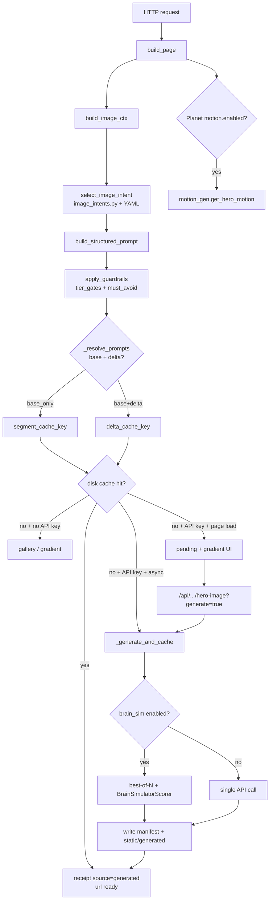

# Generation & Prompt Workflow — Confirmation, Pushback, Console Map

**Status:** As-built reference (research doc, no implementation)  
**Written:** 2026-07-10  
**Audience:** Demo nav implementors, marketer console operators, sales demo presenters  

This document validates (and corrects) the proposed five-step pipeline:

> ad data input (from link) → business/sales strategy/incentives → guardrails/provenance → create prompt → create image/text

against the **actual** Gauntlet / Planet personalization engine. It is written for the **marketer console** (`/dev/business`) and **demo nav** context described in `DEMO-NAV-PLAN.md` and `GAUNTLET-CONSOLE-HANDOFF.md`.

**Related:** `docs/04-workflow/ACTION-IMAGE-PERSONALIZATION.md`, `CONSTITUTION.md` (Art IV determinism), `rules/gauntlet_image.yaml`, `rules/planet_image.yaml`.

---

## 1. Confirmed pipeline (as-built)

The engine is **not** one linear “prompt → generate text” funnel. It is **one shared signal stack** that fans into **two independent lanes**:

| Lane | Output | LLM? | “Prompt” step? |
|------|--------|------|----------------|
| **Copy** | Deterministic slot fills on the replica | **No** | **No** — slots are filled from catalogs + rules |
| **Image** | Structured image prompt → API (optional) → cache | Image API only | **Yes** — template assembly in `image_intents.py` |

Both lanes start from the same `GS.build_page()` (Gauntlet) or `planet_site.build_page()` call. Same query params + cookie → same page (CONSTITUTION Art IV).

### 1.1 Master diagram (shared ingress → forked lanes)

```
HTTP request (query params, Referer, cookie)
│
├─ classify_entry()                    → channel: ad | email | search | direct
├─ resolve_ad_variant()                → 12-variant X catalog (if paid UTMs)
├─ scene.detect() / resolve_ip()       → tier 0–3, industry, region, network type
├─ _identity()                         → cohort CRM | work-email | anonymous
├─ _audience()                         → companies | individuals | neutral
├─ _audience_route()                   → b2b_hire | b2b_upskill | individual | neutral
└─ prioritize_objections()           → ranked objection stack (deterministic scoring)
        │
        ├──────────────────────────── COPY LANE ────────────────────────────┐
        │  Slot policy (say / allude / hold) per field                        │
        │  GENERIC baseline + ad_variant.page + identity + objection reframes   │
        │  → sections{hero, prove, challenger, compare, cta, numbers}           │
        │  → copy_diff[] (provenance per slot)                                  │
        │  NO LLM · NO prompt string · NO generation API                        │
        └───────────────────────────────────────────────────────────────────────┘
        │
        └──────────────────────────── IMAGE LANE ─────────────────────────────┐
           build_image_ctx(page)                                              │
           → select_image_intent()          [rules/*_image.yaml]              │
           → build_structured_prompt() / two-tier base+delta                  │
           → apply_guardrails() + _assert_prompt_safe()                       │
           → get_surface_image()            [cache → API → gallery → gradient] │
           → resolve_surface_image() × surfaces (hero, og)                    │
           → optional: BrainSimulatorScorer (tenant opt-in)                    │
           → Planet only: motion_gen.get_hero_motion()                        │
           └──────────────────────────────────────────────────────────────────┘
```

### 1.2 What “ad data from link” actually resolves to

A landing URL is **not** opaque “ad data.” It decomposes into concrete, typed signals:

| Signal bucket | Source | Key functions / artifacts | Used by |
|---------------|--------|---------------------------|---------|
| **Entry channel** | `utm_medium`, `ref`, Referer, `e` | `classify_entry()` | Copy framing, trace, prebuild `entry` kind |
| **Ad variant** | `utm_campaign` + `utm_content` (v01–v12) | `resolve_ad_variant()` → `AD_CATALOG` | Copy message-match slots, image `ad_metaphors`, prebuild |
| **UTM stack** | `utm_source`, `utm_medium`, `utm_campaign`, `utm_content` | Entry dict + ledger | Channel label, campaign intent keyword rules |
| **Magic token** | `e=` query param | `cohort.by_token()` | Pre-login identity (say-level name) |
| **IP / network** | Client IP or `?ip=` override | `scene.detect()`, `resolve_ip()` | Tier, industry, region, audience routing |
| **Identity** | Cookie `gauntlet_email` / `planet_email` or token | `_identity()` | Say-level copy, archetype, objection signals |
| **Audience** | Derived precedence chain | `_audience()` | CTA order, section emphasis, compare column |
| **Audience route** | Narrow hire/upskill/individual | `_audience_route()` | Objection catalog filter, image `audience_route` |
| **Objection stack** | Weighted signal match | `prioritize_objections()` | Copy reframes (allude), image intent + metaphors |
| **Tier / confidence** | IP resolution confidence | `det.tier`, `confidence{}` | Image tier gates; copy allude thresholds |

**Demo nav note:** `rules/demo_scenarios.yaml` (planned in `DEMO-NAV-PLAN.md`) only **assembles canonical query strings** into these signals — it does not add a new resolution layer.

### 1.3 Copy path vs image path (one-line truth)

- **Copy path:** `build_page()` fills **named slots** from `GENERIC` + `ad_variant.page` + identity rules + `OBJECTION_CATALOG` reframes. Provenance lives in `copy_diff[]` and `trace[]`. **No prompt. No LLM.**
- **Image path:** `build_image_ctx(page)` → YAML-driven intent → `StructuredPrompt` → optional Gemini/OpenAI image API → disk cache. Provenance lives in the image **receipt** (`intent_id`, `prompt`, `cache_key`, `guardrails_*`, optional `brain_score`).

> **Repo caveat:** `pipeline/personalization/creative.py` contains a gated LLM copy agent (`ai_copy()`). It powers the **legacy showcase / outbound variant pool** (`app/demo.py`, `generation/variants.py`), **not** the Gauntlet or Planet replica consoles. `gauntlet_site.py` and `planet_site.py` explicitly document: *deterministic — no LLM, no RNG.*

---

## 2. Stage-by-stage detail

Stages below are numbered for the **unified console mental model** (Section 4). Each stage lists inputs, processing, outputs, console visibility, and determinism.

### Stage 1 — Entry / link data capture

| | |
|---|---|
| **Inputs** | Query params (`utm_*`, `ref`, `e`, `ip`), `Referer` header, route mount |
| **Processing** | `gauntlet_site.classify_entry(request)` — pure function, no network |
| **Outputs** | `entry{channel, utm_*, ref, referer, token, rule, why, signals[]}` |
| **Console** | Marketer: **Workflow → Arrival channel**; **Data in** ledger row “Entry channel”. Engineer: process map stage `entry` |
| **Determinism** | Fully deterministic |

**Rules fired (examples):**
- `utm_medium ∈ {paid, cpc, ppc, display}` → `channel = ad`
- `utm_medium = email` → `channel = email` (+ token person if `e=` present)
- `ref ∈ SEARCH_REFS` or search Referer → `channel = search`
- else → `channel = direct`

---

### Stage 2 — IP + identity enrichment

| | |
|---|---|
| **Inputs** | Request IP (or `?ip=` override), cookie email, `entry.token` |
| **Processing** | `scene.detect()` / `resolve_ip()`; `_identity(email, entry)`; optional `segments.derive()` + `pick_archetype()` |
| **Outputs** | `det{tier, industry, region, company, city, network_type, confidence}`; `identity{kind, via, view, archetype}` or `None` |
| **Console** | **Workflow → Network read, Confidence gate, Identity, CRM persona**; **Data in** ledger (IP vendor, CRM vendor) |
| **Determinism** | Deterministic offline; live IP APIs cached via `LLMCache` (reproducible per IP key) |

**Policy split:**
- **Say:** login email, magic-token name, declared HubSpot goal, work-email company
- **Allude:** reverse-IP industry/region, archetype emphasis, HubSpot abandoned (reframed)
- **Hold:** modeled income, de-anonymized employer recitation, age/gender ad targeting facts

Planet adds a dedicated **Location** process-map stage (`planet_site.py`) when region confidence is sufficient.

---

### Stage 3 — Audience + objection stack (“sales strategy”)

| | |
|---|---|
| **Inputs** | `entry`, `ad_variant`, `det`, `identity`, `audience` |
| **Processing** | `_audience()` → companies/individuals/neutral; `_audience_route()` → b2b_hire/b2b_upskill/individual/neutral; `_collect_objection_signals()`; `prioritize_objections()`; `_apply_objection_reframes()` |
| **Outputs** | `audience`, `audience_route`, `objections{prioritized, assignments, blocked}`, updated section dicts |
| **Console** | **Decisions → Audience read, Objection stack**; **Copy** cards show slot assignments; engineer trace stage `objections` |
| **Determinism** | Fully deterministic — weighted signal scoring over `OBJECTION_CATALOG` (15 Gauntlet objections; Planet has its own catalog) |

**This is not a separate “business strategy LLM.”** It is:
1. **Audience routing** — precedence: ad variant > campaign keyword > CRM > work email > network type (`_audience()`).
2. **Objection ranking** — each catalog entry has `tracks[]`, `signals[]` with weights; top 3–5 ranked (`prioritize_objections()`).
3. **Slot weaving** — pre-authored `reframe` strings inserted into hero/prove/compare/challenger/CTA at **allude** policy (`_apply_objection_reframes()`).
4. **Blocked say variants** — `blocked_say` on objections and copy slots; visible on console only, never on replica.

Image lane reuses the objection stack via `build_image_ctx()` → `top_objection` / `top_objections` for intent selection and `objection_metaphors` in YAML.

---

### Stage 4a — Intent selection (image) vs slot policy (copy)

#### Copy: slot policy (no intent taxonomy)

| | |
|---|---|
| **Inputs** | All prior stages + `GENERIC` baseline + `ad_variant.page` overrides |
| **Processing** | Per-slot `if/elif` chains in `build_page()` with explicit `policy` (`say`/`allude`/`hold`) |
| **Outputs** | `sections{}`, `copy_diff[]` (generic vs shipped, `blocked_say`, `source`, `why`) |
| **Console** | **Copy** section — one card per slot; **Guardrails → Copy policy proposals** (staged, code-only today) |
| **Determinism** | Fully deterministic |

There is **no** `select_copy_intent()` — “intent” for copy is implicit in the slot source chain (ad message-match > identity > IP > generic).

#### Image: intent selection

| | |
|---|---|
| **Inputs** | `build_image_ctx(page)` — channel, `ad_variant_id`, `audience_route`, `top_objections`, tier-gated industry/region, CTA, archetype |
| **Processing** | `image_intents.select_image_intent(ctx, config)` reading `rules/*_image.yaml` `selection.primary_rules` (elif) + `fallback_rules` (additive) |
| **Outputs** | `ImageIntentSelection{primary, secondary, intents[], rule_fired}` |
| **Console** | **Images → {surface} → Intent selection**; `/dev/image-decisions` intent catalog |
| **Determinism** | Fully deterministic — no LLM in routing |

Gauntlet intents: `peer_proof`, `loss_avoidance`, `authority`, `aspiration`, `roi_clarity`, `retarget_warm`, `message_match`.  
Planet intents: `regional_truth`, `change_proof`, `mission_authority`, `archive_advantage`, `aspiration_research`, `retarget_warm`, `message_match`.

Each intent carries `sales_technique`, `conversion_goal`, `brain_target` (for optional scoring) — these are **labels for provenance**, not live persuasion model calls.

---

### Stage 5 — Guardrails + provenance

#### Copy guardrails

| | |
|---|---|
| **Inputs** | Slot candidates + hold-tier facts from identity/IP |
| **Processing** | Inline policy in `build_page()`; `blocked_say` recorded in `copy_diff` |
| **Outputs** | Shipped text (hold facts never emitted); blocked variants on console only |
| **Console** | **Guardrails** (copy policy proposals); engineer `#ch-audit`; `WF-DEMO-009` hold verification |
| **Determinism** | Deterministic |

Surface policy vocabulary: **say** (recite) · **allude** (steer) · **hold** (never ships).

#### Image guardrails

| | |
|---|---|
| **Inputs** | `StructuredPrompt`, `ctx._hold` (company, city, visitor_name, income_band — strip only, never emit) |
| **Processing** | `image_intents.apply_guardrails()` — tier gates, hold pattern strip, `GLOBAL_MUST_AVOID`; `image_gen._assert_prompt_safe()` — regex + PII word blocklist |
| **Outputs** | Guarded prompt; `guardrails_applied[]`, `guardrails_blocked[]` on receipt |
| **Console** | **Images → Guardrails** panel; **Guardrails** section (YAML `must_avoid`, `tier_gates`) |
| **Determinism** | Deterministic |

YAML `guardrails.tier_gates` (both tenants): `industry: 2`, `region_mood: 1`.

---

### Stage 6 — Prompt composition (image only)

| | |
|---|---|
| **Inputs** | Intent templates, `ctx`, `selection`, brand block from YAML |
| **Processing** | `build_structured_prompt()` → composition, visual_metaphor, mood, layers; two-tier split via `build_base_prompt()` + `build_personalization_delta()` |
| **Outputs** | `StructuredPrompt` with `full_prompt` assembled by `assemble_full_prompt()` / `assemble_base_prompt()` / `assemble_combined_prompt()` |
| **Console** | **Images → Prompt** (full text, layers, must_include/must_avoid); image-decisions Part 3 two-tier strategy |
| **Determinism** | Deterministic template assembly |

**Prompt structure (flattened API string):**

```
Cinematic wide hero backdrop for a {product_context}.
Primary intent: {intent_id} — {conversion_goal}.
Sales technique: {sales_technique}.
Composition: {composition_template formatted with environment, ad_metaphor, objection_metaphor, accent_color}.
Visual metaphor: {visual_metaphor}.
Mood: {mood}. Accent color {accent_color}.
[optional] Secondary intent cue: {secondary_intent_id}.
[per layer] {layer} ({disposition}): {value}.
Must include: {prompt_defaults.must_include + conversion goal + secondary cue}.
Must avoid: {prompt_defaults.must_avoid + brand.must_avoid_additions}.
Drives action: {action_map resolution → CTA slot id}.
```

**Surface overrides:** `surfaces.hero` / `surfaces.og` in YAML change `prompt_opener`, `must_include`, `composition_suffix` (`image_gen.surface_spec()`, `_apply_surface()`).

**Two-tier cache strategy:**
- **Tier 1 (segment base):** intent + ad/audience layers only — key `gauntlet:base:{ad_variant_id}` or `gauntlet:base:{intent}:{route}`
- **Tier 2 (delta):** objection metaphor, industry, region, archetype when tier gates pass — key `gauntlet:delta:{hash(signals)}`

---

### Stage 7 — Generation (API, cache, brain_sim best-of-N)

| | |
|---|---|
| **Inputs** | Guarded prompt, `IMAGE_GEN_API_KEY`, model env, `surface_id` |
| **Processing** | `get_surface_image(ctx, generate=…)` → disk cache lookup → `_generate_and_cache()` → `_call_image_api()` (Gemini or OpenAI-compatible) |
| **Outputs** | Receipt: `source` ∈ {`generated`, `pending`, `gallery`, `gradient`}, `url`, `cache_key`, `prompt`, provenance fields |
| **Console** | **Images → Receipt** (source, model, cache_key, cost); **Delivery** load policy; image-decisions Part 6 |
| **Determinism** | Cache hit: deterministic. API gen: deterministic *given* prompt+model key; best-of-N selection deterministic on proxy features |

**Fallback chain:** `cache` → `api` (or `api_failed`) → `gallery` (`scene.image_for`) → `gradient`.

**Brain simulator (opt-in per tenant YAML):**
- `brain_simulator.enabled: false` — Gauntlet default
- `brain_simulator.enabled: true` — Planet default
- `_best_of_n()`: n=3 on async `generate=True`, n=1 on prebuild warm
- `BrainSimulatorScorer.select_best()` — tries `tribe_v2` import; falls back to `proxy_v1` (vision heuristics, **not** measured brain data)
- Receipt fields: `brain_score`, `brain_region_scores`, `candidates[]`, `winner_index`

**Prebuild (offline batch, not realtime):** `scripts/warm_hero_cache.py` reads `rules/gauntlet_prebuild.yaml` (30 states × 2 surfaces = 60 entries) via `prebuild.py`.

---

### Stage 8 — Surface delivery (prebuild vs live, motion)

| | |
|---|---|
| **Inputs** | Page dict with image receipts |
| **Processing** | `build_page()` calls `resolve_surface_image(..., generate=False)` — **never blocks on API**; client `fetch` to hero API with `generate=True`; Planet `motion_gen.get_hero_motion()` when `motion.enabled` |
| **Outputs** | `hero_image`, `og_image`, `image_surfaces{hero, og}`; replica shows gradient until async swap |
| **Console** | **Delivery** inventory; **Workflow → Image surfaces**; replica (hero background only today) |
| **Determinism** | Page HTML deterministic at T0; image URL may appear after async gen (cached thereafter) |

| Load policy | Meaning | Console label |
|-------------|---------|---------------|
| pre-built | On disk + `prebuild: true` in manifest | **Delivery → pre-built** |
| warm | Runtime-generated, on disk until next deploy | warm |
| live | Cache miss + API key → gradient then async | live |
| fallback-only | No API key | gallery or CSS gradient |

**Planet motion:** `rules/planet_image.yaml` `motion.enabled: true` — multi-frame animated WebP timelapse assembled offline; honest framing: *simulated change-over-time storytelling, not neuro-stimulation*.

**Known gaps:**
- `og` surface resolved in page dict but **not** wired to live `<meta property="og:image">` (`GAUNTLET-CONSOLE-HANDOFF.md` §9)
- Only `/api/gauntlet/hero-image` async endpoint exists — no `/api/.../og-image`
- Third surfaces (section backdrop, email hero) not in manifest

---

## 3. Pushback — where the five-step model is wrong or dangerous

### 3.1 “Create prompt → create text” does not exist for the replica

**Wrong:** Treating copy as prompt-generated text.  
**Actual:** Copy is **slot substitution** from curated catalogs (`GENERIC`, `AD_CATALOG`, `OBJECTION_CATALOG`).  
**Danger:** Demoing or selling “AI writes the landing page copy live” misrepresents the product and violates CONSTITUTION Art I (truthfulness).

### 3.2 “Business / sales strategy” is not an LLM step

**Wrong:** A middle stage where a model plans incentives or strategy.  
**Actual:** Deterministic **audience routing** + **objection scoring** + **pre-authored reframes**. The `sales_technique` field on image intents is a **provenance label** from YAML, not a runtime persuasion engine.

### 3.3 Guardrails are lane-specific, not one shared gate

**Wrong:** Single guardrails/provenance stage before both text and images.  
**Actual:**
- Copy: `say/allude/hold` enforced **per slot** in `build_page()`
- Image: `tier_gates`, `must_avoid`, hold-strip, `_assert_prompt_safe()` in `image_intents` / `image_gen`

They share **philosophy** (provable surface policy) but **different mechanisms**.

### 3.4 Image generation is optional upgrade, not core path

**Wrong:** Every visit triggers realtime image gen.  
**Actual:** PRD tension documented in `image_gen.py` — *curate imagery, don't generate per-visitor*. Offline: gallery + gradient. With API key: async hero fill. Prebuild: bake 60 states into Docker image.

### 3.5 Brain simulator ≠ conversion optimization

**Wrong:** “NEvo / Tribe v2 picks the image that converts.”  
**Actual:** Opt-in **offline proxy scoring** among N candidates. Default backend is `proxy_v1` (heuristic saliency). Scores are *predicted* regional activations — **not** measured visitor brain data, **not** conversion claims. Planet enables it for demo storytelling; Gauntlet disables it by default.

### 3.6 `creative.py` LLM is a different product surface

**Wrong:** Assuming the gated copy agent powers Gauntlet/Planet.  
**Actual:** `creative.ai_copy()` serves showcase/outbound variant generation with Gate verification. **Gauntlet and Planet replica paths never import it.**

### 3.7 “Ad data from link” oversimplifies identity

**Wrong:** Reducing entry to UTMs alone.  
**Actual:** Richest stack is **email + magic token + CRM** (demo nav richness: `direct < search < ads < email`). Corporate IP and login cookie can completely change audience, objections, and image delta layers without any ad UTMs.

### 3.8 Staged console edits do not change runtime

**Danger:** Marketers may believe unchecking a `must_avoid` in the staged drawer affects the live page.  
**Actual:** Drawer is **client-side only** — requires YAML commit + deploy (and `warm_hero_cache` for prebuild changes).

---

## 4. Recommended unified workflow (marketer console UI)

Use a **10-stage model** that unifies copy + image without changing the engine. Maps 1:1 to existing console sections.

| # | Stage | Copy lane | Image lane | Editable in console? |
|---|-------|-----------|------------|---------------------|
| 1 | **Arrival** | `classify_entry` | same ctx | Read-only (replay via query params) |
| 2 | **Campaign match** | `resolve_ad_variant` → page slots | `ad_metaphors`, message_match intent | Read-only; ad catalog in code |
| 3 | **Network & location** | IP allude slots | tier gates for industry/region layers | Read-only; `?ip=` on console |
| 4 | **Identity & CRM** | say/allude identity slots | archetype delta (tier-gated) | Read-only; `as=` preview toggle |
| 5 | **Audience routing** | CTA order, compare emphasis | `audience_route` in intent rules | Read-only |
| 6 | **Objection stack** | reframe → copy slots | top objection → intent + metaphor | Read-only (catalog in code); proposals only |
| 7 | **Surface policy** | say/allude/hold per slot | `must_avoid`, tier_gates | Copy: **proposal only**; Image: **staged YAML** |
| 8 | **Composition** | slot assembly (`copy_diff`) | `StructuredPrompt` + two-tier | Copy: code; Image: intents YAML (staged) |
| 9 | **Generation** | *(no op)* | cache / API / brain_sim / motion | Prebuild toggles staged; warm via deploy script |
| 10 | **Delivery** | replica HTML | per-surface URL + load policy | Delivery inventory read-only; prebuild staged |

**Editability summary:**

| Artifact | Editable today | Mechanism |
|----------|----------------|-----------|
| `rules/gauntlet_image.yaml` | Staged diff → manual commit | must_avoid, tier_gates, intents, surfaces |
| `rules/gauntlet_prebuild.yaml` | Staged toggles → manual commit | per-state × surface `prebuild:` flag |
| `rules/gauntlet_copy.yaml` | **Does not exist** | Follow-up; console shows proposals pointing at `gauntlet_site.py` |
| `OBJECTION_CATALOG` / `AD_CATALOG` | Code only | Requires Python edit + deploy |
| Query / cookie / `as=` | Operator controls | URL bar, login, hub toggle |

---

## 5. Mermaid flowcharts

### 5.1 Image path



### 5.2 Copy path

```mermaid
flowchart TD
  A[HTTP request] --> B[classify_entry]
  B --> C[resolve_ip + identity]
  C --> D[resolve_ad_variant]
  D --> E[_audience + _audience_route]
  E --> F[prioritize_objections]
  F --> G[build_page slot assembly]
  G --> H{per-slot policy}
  H -->|say| I[recite: name, goal, company]
  H -->|allude| J[shape: industry, reframe, ad match]
  H -->|hold| K[block: income, de-anon, age/gender]
  I --> L[sections + copy_diff]
  J --> L
  K --> M[blocked_say on console only]
  M -.-> L
  L --> N[replica HTML]
  L --> O[/dev + /dev/business trace]
```

---

## 6. Console UI mapping

### 6.1 Marketer console (`/dev/business`) — 8 sections

| Sidebar # | Section ID | Pipeline stages covered | Primary artifacts |
|-----------|------------|-------------------------|-------------------|
| 1 | Overview | 1–10 summary | changed slot count, surface sources, guardrails fired |
| 2 | Workflow | 1–10 tree | `GDB._workflow()` ← `GS.process_map()` + image surfaces node |
| 3 | Data in | 1–2 | `ledger[]` — Clay-style signal table |
| 4 | Decisions | 3–6 | audience read, objection stack, confidence gate |
| 5 | Copy | 6–8 (copy) | `copy_cards` — slot, policy, blocked_say |
| 6 | Images | 4–10 (image) | per-surface sub-nav: hero, og — intent, prompt, receipt |
| 7 | Guardrails | 5–7 | image YAML rules + copy policy proposals |
| 8 | Delivery | 9–10 | prebuild manifest, load policy per state × surface |

### 6.2 Engineer console (`/dev`)

| Panel | Stages |
|-------|--------|
| `#ch-pipeline` process map | 1–8 + hero image (11 stages) |
| Plain-English story | 1–3 narrative |
| Hero image dev panel | 6–10 (image) |
| Copy diff / audit | 5–8 (copy) |

### 6.3 Image decisions guide (`/dev/image-decisions`)

| Part | Content | `gauntlet_image_decisions.pipeline_steps()` id |
|------|---------|-----------------------------------------------|
| Intent catalog | YAML intents + brain_target table | — |
| Pipeline walkthrough | 8 steps | signals → intent → two_tier → prompt → guardrails → brain_sim → cache → render |
| Part 6 | Pre-cached vs live inventory | ties to **Delivery** |

### 6.4 Demo nav (`/apt/demo` — planned)

| Channel gallery | Richest stages demonstrated |
|-----------------|----------------------------|
| Direct | 1, 3 (IP-only) |
| Search | 1, 3 |
| Ads | 1, 2, 4a-image, 6–8 |
| Email | 1–6 (token identity + objections) |

Cross-link pattern: every scenario card → `console_deep_link_pattern` → marketer or engineer console with same query string.

### 6.5 Missing for realtime secondary images

| Gap | Impact | Workaround today |
|-----|--------|------------------|
| No `og:image` on replica | Social unfurl doesn't show personalized og | Console shows og receipt only |
| No async API for og | og generates only at `build_page` cache check | Prebuild og in manifest |
| Hero-only client fetch | Only hero swaps after load | og stays gradient/pending on miss |
| No third surfaces in prebuild | Section/email images not in Delivery grid | Extend `surfaces` in YAML + manifest |
| Copy not YAML-driven | Marketers can't edit slot rules without code | Staged proposals only |

---

## Appendix A — Module quick reference

| Module | Role |
|--------|------|
| `gauntlet_site.build_page` | Orchestrator — copy + image surfaces |
| `gauntlet_site.classify_entry` | Entry channel |
| `gauntlet_site.prioritize_objections` | Objection ranking |
| `image_gen.build_image_ctx` | Image context from page |
| `image_gen.resolve_hero_image` | Hero surface + Planet motion hook |
| `image_intents.select_image_intent` | YAML rule chain |
| `image_intents.build_structured_prompt` | Template assembly |
| `brain_simulator.BrainSimulatorScorer` | Optional best-of-N |
| `gauntlet_dev_business.build_business_dev_view` | Marketer console VM |
| `gauntlet_image_decisions.pipeline_steps` | Educational pipeline list |
| `prebuild.load_prebuild_manifest` | Delivery / warm script SSOT |

---

## Appendix B — Tenant differences (Gauntlet vs Planet)

| Dimension | Gauntlet | Planet |
|-----------|----------|--------|
| Image YAML | `rules/gauntlet_image.yaml` | `rules/planet_image.yaml` |
| brain_simulator | `enabled: false` | `enabled: true` |
| motion | `enabled: false` | `enabled: true` (animated WebP) |
| Default intent | `peer_proof` | `regional_truth` |
| Audience routes | b2b_hire, b2b_upskill, individual | enterprise, selfserve, research |
| Location stage | IP allude in copy | Dedicated process-map Location stage |
| Objection catalog | Hiring/L&D/Challenger themes | Satellite/procurement themes |

---

## Design prompt database

**SSOT:** `rules/design_prompts.yaml`  
**Loader:** `pipeline/personalization/design_prompts.py`

A human-editable **reference catalog** of image prompt templates and fully resolved examples. It does **not** replace runtime image generation in v1 — `image_gen` / `image_intents` still read `rules/*_image.yaml`. The database is for:

| Consumer | Use |
|----------|-----|
| **Marketer console** | Stage prompt examples, link Images panel to catalog ids, document `load_policy` (prebuild / warm / live) |
| **Demo nav** | Cross-link scenarios (`rules/demo_scenarios.yaml`) to canonical prompt entries |
| **warm_hero_cache** | Document which entries map to prebuild manifest states |
| **image_gen** | Reference only — `resolve_example()` delegates to the same assembly path |

### Copy vs image entries

| `kind` | Meaning |
|--------|---------|
| `image` | Structured image prompt — `prompt_template` + `example_resolved` |
| `copy_slot` | Slot assembly reference only — **no prompt string** (`gauntlet.copy.hero.headline`) |

### Placeholder variables

Documented under `meta.placeholders` in the YAML: `{product}`, `{intent_id}`, `{environment}`, `{region}`, `{ad_metaphor}`, `{objection_metaphor}`, `{accent_color}`, `{audience_route}`, `{channel}`, etc.

### Loader API

```python
from pipeline.personalization import design_prompts as DP

db = DP.load_db()
entry = DP.get_entry("gauntlet.hero.message_match.ad")
rows = DP.list_entries(tenant="gauntlet", surface="hero", channel="ad")
prompt = DP.resolve_example("gauntlet.hero.message_match.ad")
prompt = DP.resolve_example("planet.hero.regional_truth.region", {"tier": 0})
ids = DP.intent_index(tenant="gauntlet", surface="hero")
```

- `resolve_example()` builds page ctx from `example_page_params` or uses `example_image_ctx`, then runs `image_intents` + surface overrides (same as `image_gen`).
- Entries with `catalog_intent: true` resolve the YAML intent template directly (reference cards) even when live selection would differ.

### Console / demo reference pattern

1. Demo scenario card (`demo_nav`) → `console_deep_link_pattern` with same query params.
2. Lookup matching prompt: `DP.list_entries(tenant=..., channel=scenario.channel)`.
3. Show `example_resolved` in marketer **Images → Prompt** staging drawer; call `resolve_example(id)` to verify live assembly matches after YAML edits.

Tests: `tests/test_design_prompts.py`

---

*Research completed 2026-07-10. Update when `rules/gauntlet_copy.yaml` ships or og async API is added.*
