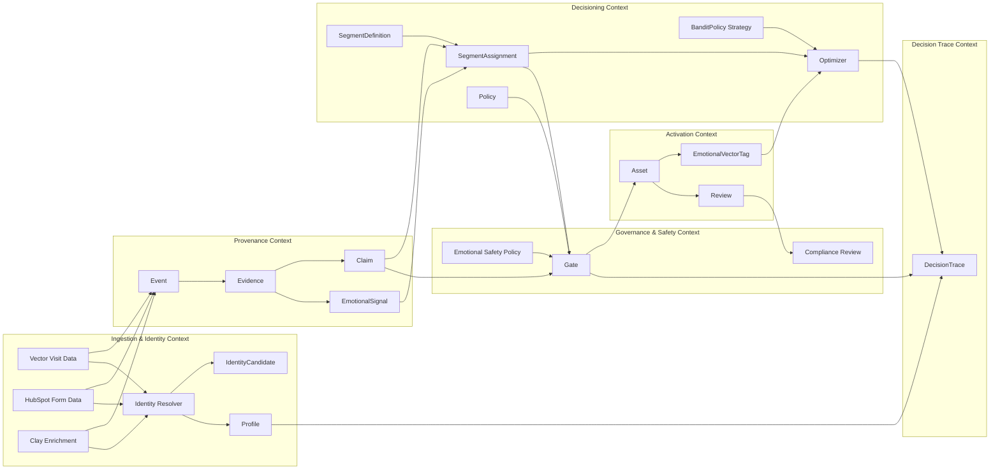

# Context Map

```mermaid
flowchart LR
    subgraph Ingestion["Ingestion & Identity Context"]
        V[Vector Visit Data]
        H[HubSpot Form Data]
        C[Clay Enrichment]
        IR[Identity Resolver]
        IC[IdentityCandidate]
        PR[Profile]
    end

    subgraph Provenance["Provenance Context"]
        E[Event]
        EV[Evidence]
        CL[Claim]
        ESG[EmotionalSignal]
    end

    subgraph Decisioning["Decisioning Context"]
        SD[SegmentDefinition]
        SA[SegmentAssignment]
        P[Policy]
        O[Optimizer]
        BP[BanditPolicy Strategy]
    end

    subgraph Activation["Activation Context"]
        A[Asset]
        VT[EmotionalVectorTag]
        R[Review]
    end

    subgraph Governance["Governance & Safety Context"]
        G[Gate]
        EP[Emotional Safety Policy]
        CR[Compliance Review]
    end

    subgraph Explainability["Decision Trace Context"]
        DT[DecisionTrace]
    end

    V --> E
    H --> E
    C --> E
    V --> IR
    H --> IR
    C --> IR
    IR --> IC
    IR --> PR
    E --> EV
    EV --> CL
    EV --> ESG
    CL --> SA
    ESG --> SA
    SD --> SA
    SA --> O
    BP --> O
    A --> VT
    VT --> O
    CL --> G
    SA --> G
    P --> G
    EP --> G
    G --> A
    G --> DT
    O --> DT
    A --> R
    R --> CR
    PR --> DT
```
