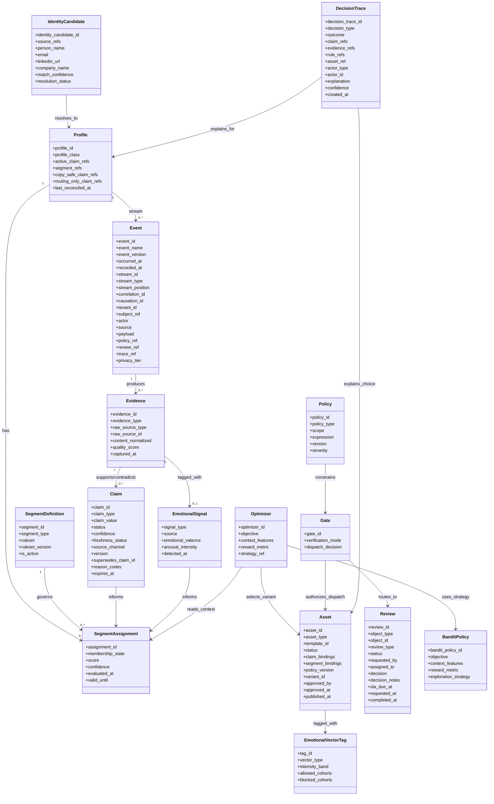

# Aggregate Model

```mermaid
classDiagram
    class Profile {
      +profile_id
      +profile_class
      +active_claim_refs
      +segment_refs
      +copy_safe_claim_refs
      +routing_only_claim_refs
      +last_reconciled_at
    }

    class IdentityCandidate {
      +identity_candidate_id
      +source_refs
      +person_name
      +email
      +linkedin_url
      +company_name
      +match_confidence
      +resolution_status
    }

    class Event {
      +event_id
      +event_name
      +event_version
      +occurred_at
      +recorded_at
      +stream_id
      +stream_type
      +stream_position
      +correlation_id
      +causation_id
      +tenant_id
      +subject_ref
      +actor
      +source
      +payload
      +policy_ref
      +review_ref
      +trace_ref
      +privacy_tier
    }

    class Evidence {
      +evidence_id
      +evidence_type
      +raw_source_type
      +raw_source_id
      +content_normalized
      +quality_score
      +captured_at
    }

    class Claim {
      +claim_id
      +claim_type
      +claim_value
      +status
      +confidence
      +freshness_status
      +source_channel
      +version
      +supersedes_claim_id
      +reason_codes
      +expires_at
    }

    class SegmentDefinition {
      +segment_id
      +segment_type
      +ruleset
      +ruleset_version
      +is_active
    }

    class SegmentAssignment {
      +assignment_id
      +membership_state
      +score
      +confidence
      +evaluated_at
      +valid_until
    }

    class Policy {
      +policy_id
      +policy_type
      +scope
      +expression
      +version
      +severity
    }

    class Asset {
      +asset_id
      +asset_type
      +template_id
      +status
      +claim_bindings
      +segment_bindings
      +policy_version
      +variant_id
      +approved_by
      +approved_at
      +published_at
    }

    class Review {
      +review_id
      +object_type
      +object_id
      +review_type
      +status
      +requested_by
      +assigned_to
      +decision
      +decision_notes
      +sla_due_at
      +requested_at
      +completed_at
    }

    class DecisionTrace {
      +decision_trace_id
      +decision_type
      +outcome
      +claim_refs
      +evidence_refs
      +rule_refs
      +asset_ref
      +actor_type
      +actor_id
      +explanation
      +confidence
      +created_at
    }

    class EmotionalSignal {
      +signal_type
      +source
      +emotional_valence
      +arousal_intensity
      +detected_at
    }

    class EmotionalVectorTag {
      +tag_id
      +vector_type
      +intensity_band
      +allowed_cohorts
      +blocked_cohorts
    }

    class Optimizer {
      +optimizer_id
      +objective
      +context_features
      +reward_metric
      +strategy_ref
    }

    class BanditPolicy {
      +bandit_policy_id
      +objective
      +context_features
      +reward_metric
      +exploration_strategy
    }

    class Gate {
      +gate_id
      +verification_mode
      +dispatch_decision
    }

    Profile "1" --> "0..*" Event : stream
    IdentityCandidate --> Profile : resolves_to
    Event "1" --> "0..*" Evidence : produces
    Evidence "1" --> "0..*" Claim : supports/contradicts
    Evidence "1" --> "0..1" EmotionalSignal : tagged_with
    Profile "1" --> "0..*" SegmentAssignment : has
    SegmentDefinition "1" --> "0..*" SegmentAssignment : governs
    Claim --> SegmentAssignment : informs
    EmotionalSignal --> SegmentAssignment : informs
    Asset --> EmotionalVectorTag : tagged_with
    Optimizer --> BanditPolicy : uses_strategy
    Optimizer --> Asset : selects_variant
    Optimizer --> SegmentAssignment : reads_context
    Policy --> Gate : constrains
    Gate --> Asset : authorizes_dispatch
    Gate --> Review : routes_to
    DecisionTrace --> Profile : explains_for
    DecisionTrace --> Asset : explains_choice
```
