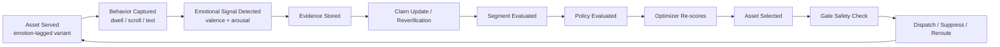

# Emotional Reaction Cycle

```mermaid
flowchart LR
    A1[Asset Served<br/>emotion-tagged variant]
    B1[Behavior Captured<br/>dwell / scroll / text]
    C1[Emotional Signal Detected<br/>valence + arousal]
    D1[Evidence Stored]
    E1[Claim Update / Reverification]
    F1[Segment Evaluated]
    G1[Policy Evaluated]
    H1[Optimizer Re-scores]
    I1[Asset Selected]
    J1[Gate Safety Check]
    K1[Dispatch / Suppress / Reroute]

    A1 --> B1 --> C1 --> D1 --> E1 --> F1 --> G1 --> H1 --> I1 --> J1 --> K1
    K1 --> A1
```
