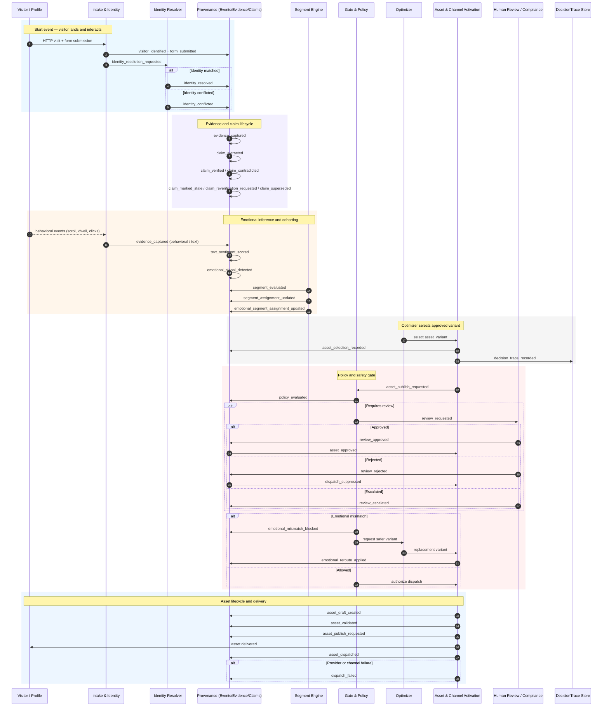

# Sequence Diagram

```mermaid
sequenceDiagram
    autonumber
    participant Visitor as Visitor / Profile
    participant Intake as Intake & Identity
    participant Resolver as Identity Resolver
    participant Prov as Provenance (Events/Evidence/Claims)
    participant Seg as Segment Engine
    participant Gate as Gate & Policy
    participant Optimizer as Optimizer
    participant Activ as Asset & Channel Activation
    participant Review as Human Review / Compliance
    participant Trace as DecisionTrace Store

    rect rgb(235, 248, 255)
    Note over Visitor,Intake: Start event — visitor lands and interacts
    Visitor->>Intake: HTTP visit + form submission
    Intake->>Prov: visitor_identified + form_submitted
    Intake->>Resolver: identity_resolution_requested
    alt Identity matched
        Resolver->>Prov: identity_resolved
    else Identity conflicted
        Resolver->>Prov: identity_conflicted
    end
    end

    rect rgb(243, 240, 255)
    Note over Prov: Evidence and claim lifecycle
    Prov->>Prov: evidence_captured
    Prov->>Prov: claim_extracted
    Prov->>Prov: claim_verified / claim_contradicted
    Prov->>Prov: claim_marked_stale / claim_reverification_requested / claim_superseded
    end

    rect rgb(255, 246, 235)
    Note over Prov,Seg: Emotional inference and cohorting
    Visitor-->>Intake: behavioral events (scroll, dwell, clicks)
    Intake->>Prov: evidence_captured (behavioral / text)
    Prov->>Prov: text_sentiment_scored
    Prov->>Prov: emotional_signal_detected
    Seg->>Prov: segment_evaluated
    Seg->>Prov: segment_assignment_updated
    Seg->>Prov: emotional_segment_assignment_updated
    end

    rect rgb(245, 245, 245)
    Note over Optimizer,Activ: Optimizer selects approved variant
    Optimizer->>Activ: select asset_variant
    Activ->>Prov: asset_selection_recorded
    Activ->>Trace: decision_trace_recorded
    end

    rect rgb(255, 241, 241)
    Note over Gate: Policy and safety gate
    Activ->>Gate: asset_publish_requested
    Gate->>Prov: policy_evaluated
    alt Requires review
        Gate->>Review: review_requested
        alt Approved
            Review->>Prov: review_approved
            Prov->>Activ: asset_approved
        else Rejected
            Review->>Prov: review_rejected
            Prov->>Activ: dispatch_suppressed
        else Escalated
            Review->>Prov: review_escalated
        end
    end
    alt Emotional mismatch
        Gate->>Prov: emotional_mismatch_blocked
        Gate->>Optimizer: request safer variant
        Optimizer->>Activ: replacement variant
        Activ->>Prov: emotional_reroute_applied
    else Allowed
        Gate->>Activ: authorize dispatch
    end
    end

    rect rgb(237, 246, 255)
    Note over Activ,Visitor: Asset lifecycle and delivery
    Activ->>Prov: asset_draft_created
    Activ->>Prov: asset_validated
    Activ->>Prov: asset_publish_requested
    Activ->>Visitor: asset delivered
    Activ->>Prov: asset_dispatched
    alt Provider or channel failure
        Activ->>Prov: dispatch_failed
    end
    end
```
