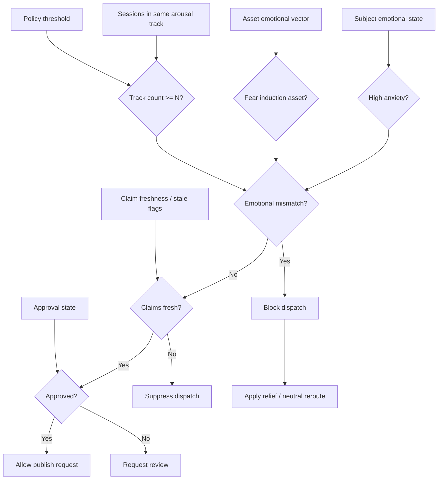

# Gate Mismatch Circuit Breaker

```mermaid
flowchart TD
    S1[Subject emotional state]
    S2[Asset emotional vector]
    S3[Sessions in same arousal track]
    S4[Policy threshold]
    S5[Claim freshness / stale flags]
    S6[Approval state]

    S1 --> D{High anxiety?}
    S2 --> E{Fear induction asset?}
    S3 --> F{Track count >= N?}
    S4 --> F
    S5 --> G{Claims fresh?}
    S6 --> H{Approved?}

    D --> I
    E --> I
    F --> I
    I{Emotional mismatch?}

    I -->|Yes| J[Block dispatch]
    J --> K[Apply relief / neutral reroute]
    I -->|No| G
    G -->|No| L[Suppress dispatch]
    G -->|Yes| H
    H -->|No| M[Request review]
    H -->|Yes| N[Allow publish request]
```
