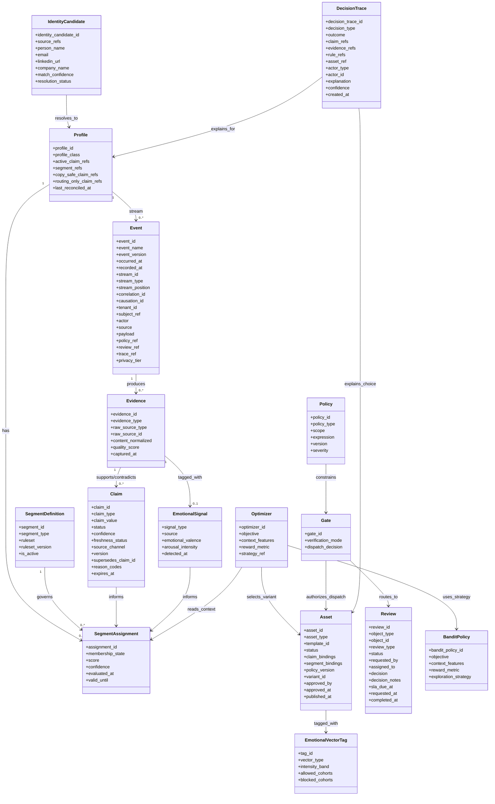

# Field / Purpose and Complete Domain Data Model

## Overview

This document consolidates the current canonical entities, their field-purpose definitions, and the full domain data model after the recent event-catalog, stream, identity-resolution, and optimizer naming updates.

## Entities

Core entities in the model are: `Profile`, `IdentityCandidate`, `Event`, `Evidence`, `Claim`, `SegmentDefinition`, `SegmentAssignment`, `Policy`, `Asset`, `Review`, `DecisionTrace`, `EmotionalSignal`, `EmotionalVectorTag`, `Optimizer`, `BanditPolicy`, and `Gate`.[file:293][file:296]

## Field / Purpose

### Profile

| Field | Purpose |
|---|---|
| profile_id | Stable canonical person/account identity used for routing and personalization. |
| profile_class | Distinguishes the operating profile class, such as lead, account, customer, or partner. |
| active_claim_refs | References currently active claims associated with the profile. |
| segment_refs | References current segment memberships. |
| copy_safe_claim_refs | References claims cleared for direct content use. |
| routing_only_claim_refs | References claims usable for internal routing but not copy generation. |
| last_reconciled_at | Audit timestamp for the last identity/claim reconciliation pass. |

### IdentityCandidate

| Field | Purpose |
|---|---|
| identity_candidate_id | Temporary id before a confirmed canonical identity exists. |
| source_refs | Links to Vector visit, HubSpot submission, Clay enrichment, or other source records. |
| person_name | Best current normalized name. |
| email | Known email if any. |
| linkedin_url | Known LinkedIn or equivalent profile link. |
| company_name | Best current normalized employer or account name. |
| match_confidence | Confidence that source records belong to the same person/account. |
| resolution_status | Pending, linked, conflicted, or rejected. |

### Event

| Field | Purpose |
|---|---|
| event_id | Global unique identifier for idempotency and audit. |
| event_name | Stable snake_case domain event name. |
| event_version | Payload contract version for this event type. |
| occurred_at | Business time when the event happened. |
| recorded_at | Time the system persisted the event. |
| stream_id | Aggregate stream for ordered replay. |
| stream_type | Aggregate class such as lead, account, asset, review, or decision_trace. |
| stream_position | Sequence number within the stream. |
| correlation_id | Groups related events in one workflow chain. |
| causation_id | Links this event to the prior triggering event. |
| tenant_id | Multi-tenant organization boundary. |
| subject_ref | Business entity the event is about. |
| actor | Human or system that caused the event. |
| source | Channel/system context for capture. |
| payload | Business-specific body unique per event type. |
| policy_ref | Applied policy context when relevant. |
| review_ref | Associated review context when relevant. |
| trace_ref | Linked decision trace id when relevant. |
| privacy_tier | Identity/privacy classification in force. |

### Evidence

| Field | Purpose |
|---|---|
| evidence_id | Stable unique identifier for the evidence object. |
| evidence_type | Distinguishes source artifact type such as form field, transcript, enrichment blob, or behavior. |
| raw_source_type | Names the original system or channel. |
| raw_source_id | Original record id in that source system. |
| content_normalized | Canonical normalized content or extracted representation. |
| quality_score | Trust or parsing quality score. |
| captured_at | Time the evidence was recorded. |

### Claim

| Field | Purpose |
|---|---|
| claim_id | Stable unique identifier for the claim instance. |
| claim_type | Category of asserted fact, such as company_stage or budget_band. |
| claim_value | Normalized asserted value. |
| status | Lifecycle state such as proposed, verified, contradicted, stale, or deprecated. |
| confidence | System confidence in the current claim state. |
| freshness_status | Indicates whether the claim is current enough for use. |
| source_channel | Where the claim originated, such as form, CRM, transcript, or enrichment feed. |
| version | Version number of the claim record. |
| supersedes_claim_id | Prior claim version replaced by this one. |
| reason_codes | Structured reasons for status or routing constraints. |
| expires_at | When the claim should no longer be trusted without revalidation. |

### SegmentDefinition

| Field | Purpose |
|---|---|
| segment_id | Stable unique identifier for the segment definition. |
| segment_type | Business or emotional segment classification type. |
| ruleset | Executable rules or expression tree for evaluation. |
| ruleset_version | Version of the segment logic. |
| is_active | Indicates whether the definition is currently in use. |

### SegmentAssignment

| Field | Purpose |
|---|---|
| assignment_id | Stable unique identifier for an assignment instance. |
| membership_state | In, out, pending, or another assignment state. |
| score | Numeric fit or ranking score. |
| confidence | Confidence in the assignment result. |
| evaluated_at | When the segment was last evaluated. |
| valid_until | When the assignment should expire or be recomputed. |

### Policy

| Field | Purpose |
|---|---|
| policy_id | Stable unique identifier for the policy bundle or rule. |
| policy_type | Copy, routing, freshness, compliance, safety, or other policy class. |
| scope | The subject or channel scope the policy applies to. |
| expression | Executable rule expression or structured policy body. |
| version | Policy version used for audit. |
| severity | Warning, blocking, or other severity level. |

### Asset

| Field | Purpose |
|---|---|
| asset_id | Stable unique identifier for the asset. |
| asset_type | Email, landing page, ad, banner, or other channel/format. |
| template_id | Composition pattern or template reference used to build the asset. |
| status | Draft, validated, approved, live, retired, or other lifecycle state. |
| claim_bindings | Claims used to compose the asset. |
| segment_bindings | Segments that informed eligibility or messaging. |
| policy_version | Policy rules applied during validation. |
| variant_id | Distinguishes A/B or multivariate versions. |
| approved_by | Human approver when manual review occurs. |
| approved_at | When approval happened. |
| published_at | When the asset went live or was sent. |

### Review

| Field | Purpose |
|---|---|
| review_id | Stable unique identifier for the review task. |
| object_type | What is under review, such as claim, asset, segment, or rule. |
| object_id | Specific object being reviewed. |
| review_type | Factual verification, policy approval, or exception handling. |
| status | Queued, in_review, approved, rejected, or escalated. |
| requested_by | User or system that initiated the review. |
| assigned_to | Current reviewer or queue owner. |
| decision | Final human outcome. |
| decision_notes | Reviewer explanation or comments. |
| sla_due_at | Operational due time for the review. |
| requested_at | When the review was created. |
| completed_at | When the review was closed. |

### DecisionTrace

| Field | Purpose |
|---|---|
| decision_trace_id | Stable unique identifier for the trace record. |
| decision_type | Type of decision, such as segment assignment, send/no-send, or asset selection. |
| outcome | Final result of the decision. |
| claim_refs | Claims materially used in the decision. |
| evidence_refs | Evidence objects that supported the outcome. |
| rule_refs | Rules or policies applied. |
| asset_ref | Chosen asset when relevant. |
| actor_type | Whether the final decision was system, human, or hybrid. |
| actor_id | Specific deciding actor. |
| explanation | Readable explanation or structured rationale summary. |
| confidence | Confidence in the decision if applicable. |
| created_at | When the trace was recorded. |

### EmotionalSignal

| Field | Purpose |
|---|---|
| signal_type | Type of emotional signal inferred. |
| source | Where the signal came from, such as text, dwell, scroll, or click pattern. |
| emotional_valence | Positive, negative, or neutral valence. |
| arousal_intensity | High, medium, or low arousal intensity. |
| detected_at | When the signal was inferred. |

### EmotionalVectorTag

| Field | Purpose |
|---|---|
| tag_id | Stable unique identifier for the vector tag. |
| vector_type | Emotional framing strategy such as fear_PAS, ecstasis_future_pacing, or relief_BAB. |
| intensity_band | Strength or escalation band for the vector. |
| allowed_cohorts | Cohorts that may safely receive this vector. |
| blocked_cohorts | Cohorts that must not receive this vector. |

### Optimizer

| Field | Purpose |
|---|---|
| optimizer_id | Stable unique identifier for the decisioning component instance/config. |
| objective | Durable business objective for selection. |
| context_features | Inputs used for contextual selection. |
| reward_metric | Outcome metric optimized over time. |
| strategy_ref | Reference to the specific optimization strategy implementation, such as BanditPolicy. |

### BanditPolicy

| Field | Purpose |
|---|---|
| bandit_policy_id | Stable unique identifier for the strategy object. |
| objective | Objective function for the bandit policy. |
| context_features | Features used as bandit context. |
| reward_metric | Reward signal being learned from. |
| exploration_strategy | Explore/exploit strategy such as epsilon-greedy or Thompson sampling. |

### Gate

| Field | Purpose |
|---|---|
| gate_id | Stable unique identifier for the gate instance or config. |
| verification_mode | Policy/verification mode used for the current check. |
| dispatch_decision | Final allow, reroute, suppress, or review outcome. |

## Complete Domain Data Model

