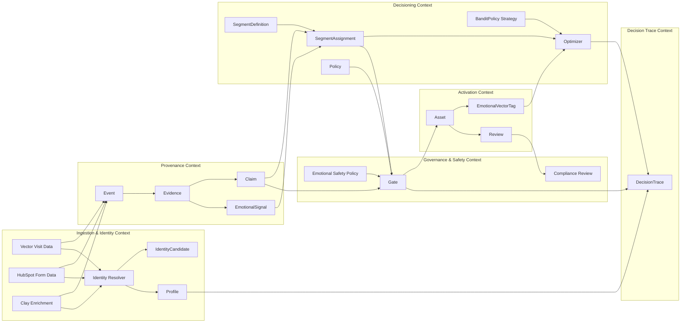

# Context Map

> North-star target. See [../implemented/runtime-mapping.md](../implemented/runtime-mapping.md) for runtime status and [../implementation-gap.md](../implementation-gap.md) for remaining work.

